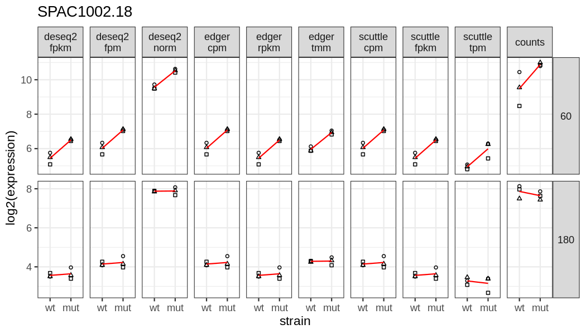

Normalisation of bulk RNA-seq counts
====================================

I-Hsuan Lin

University of Manchester

March 09, 2022

Introduction
------------

This is a reproducible demo that shows readers how to use perform count
normalisation of RNA-seq data using several common methods
([ref1](https://hbctraining.github.io/DGE_workshop/lessons/02_DGE_count_normalization.html),
[ref2](https://www.reneshbedre.com/blog/expression_units.html)):

-   **DESeq2’s median-of-ratios**: raw counts are divided by
    sample-specific size factors determined by median ratio of gene
    counts relative to geometric mean per gene.
-   **edgeR’s TMM (trimmed mean of M-values)**: a weighted average of
    the subset of genes (excluding highly expressed and highly variable
    genes) is used to calculate per-sample normalisation factor.
-   **RPM/FPM/CPM (reads/fragments/counts per million mapped
    reads/fragments)**: raw counts are scaled by total number of reads
    mapped in each sample.
-   **TPM (transcripts per million mapped reads)**: calculates the
    counts per kilobase of transcript length per million mapped reads.
-   **RPKM/FPKM (reads/fragments per kilobase of transcript length per
    million mapped reads/fragments)**: similar to TPM.

### About demo datasets

The
[fission](https://www.bioconductor.org/packages/release/data/experiment/html/fission.html)
dataset provides a `RangedSummarizedExperiment` object of read counts in
genes for a time course RNA-Seq experiment of fission yeast
(*Schizosaccharomyces pombe*) in response to oxidative stress at 0, 15,
30, 60, 120 and 180 mins.

Loading required libraries
--------------------------

``` r
library(fission)
library(DESeq2)
library(edgeR)
library(ggplot2)
#library(scuttle) # call functions using "::"
```

Load `fission` dataset
----------------------

``` r
#--- data-loading ---#
data("fission")
fission
```

    ## class: RangedSummarizedExperiment 
    ## dim: 7039 36 
    ## metadata(1): ''
    ## assays(1): counts
    ## rownames(7039): SPAC212.11 SPAC212.09c ... SPMITTRNAGLU.01 SPMIT.11
    ## rowData names(2): symbol biotype
    ## colnames(36): GSM1368273 GSM1368274 ... GSM1368307 GSM1368308
    ## colData names(4): strain minute replicate id

``` r
rowRanges(fission) # shows GRanges object
```

    ## GRanges object with 7039 ranges and 2 metadata columns:
    ##                   seqnames      ranges strand |          symbol        biotype
    ##                      <Rle>   <IRanges>  <Rle> |     <character>       <factor>
    ##        SPAC212.11        I      1-5662      - |            tlh1 protein_coding
    ##       SPAC212.09c        I   7619-9274      + |     SPAC212.09c pseudogene    
    ##        SPNCRNA.70        I 11027-11556      - |      SPNCRNA.70 ncRNA         
    ##        SPAC212.12        I 15855-16226      + |      SPAC212.12 protein_coding
    ##       SPAC212.04c        I 21381-23050      + |     SPAC212.04c protein_coding
    ##               ...      ...         ...    ... .             ...            ...
    ##   SPMITTRNATYR.01       MT 17257-17342      + | SPMITTRNATYR.01 tRNA          
    ##   SPMITTRNAILE.02       MT 17542-17613      + | SPMITTRNAILE.02 tRNA          
    ##          SPMIT.10       MT 17806-18030      + |            atp9 protein_coding
    ##   SPMITTRNAGLU.01       MT 18404-18475      + | SPMITTRNAGLU.01 tRNA          
    ##          SPMIT.11       MT 18561-19307      + |            cox2 protein_coding
    ##   -------
    ##   seqinfo: 4 sequences from an unspecified genome; no seqlengths

``` r
str(data.frame(colData(fission)))
```

    ## 'data.frame':    36 obs. of  4 variables:
    ##  $ strain   : Factor w/ 2 levels "wt","mut": 1 1 1 1 1 1 1 1 1 1 ...
    ##  $ minute   : Factor w/ 6 levels "0","15","30",..: 1 1 1 2 2 2 3 3 3 4 ...
    ##  $ replicate: Factor w/ 3 levels "r1","r2","r3": 1 2 3 1 2 3 1 2 3 1 ...
    ##  $ id       : chr  "wt_0_r1" "wt_0_r2" "wt_0_r3" "wt_15_r1" ...

``` r
#--- subset to 2 time points ---#
sel <- colData(fission)$minute %in% c(60,180)
DF <- droplevels(colData(fission)[sel,])
as.data.frame(DF)
```

    ##            strain minute replicate         id
    ## GSM1368282     wt     60        r1   wt_60_r1
    ## GSM1368283     wt     60        r2   wt_60_r2
    ## GSM1368284     wt     60        r3   wt_60_r3
    ## GSM1368288     wt    180        r1  wt_180_r1
    ## GSM1368289     wt    180        r2  wt_180_r2
    ## GSM1368290     wt    180        r3  wt_180_r3
    ## GSM1368300    mut     60        r1  mut_60_r1
    ## GSM1368301    mut     60        r2  mut_60_r2
    ## GSM1368302    mut     60        r3  mut_60_r3
    ## GSM1368306    mut    180        r1 mut_180_r1
    ## GSM1368307    mut    180        r2 mut_180_r2
    ## GSM1368308    mut    180        r3 mut_180_r3

``` r
counts <- assay(fission)[,sel]
dim(counts) # number of genes and samples
```

    ## [1] 7039   12

``` r
head(counts)
```

    ##             GSM1368282 GSM1368283 GSM1368284 GSM1368288 GSM1368289 GSM1368290
    ## SPAC212.11           2         10          8         10          6         10
    ## SPAC212.09c         40         93         73         43         89         38
    ## SPNCRNA.70           0          0          0          0          0          0
    ## SPAC212.12           1          0          0          0          0          1
    ## SPAC212.04c         10         32         23         25         29         17
    ## SPAC212.03           0          0          0          0          0          0
    ##             GSM1368300 GSM1368301 GSM1368302 GSM1368306 GSM1368307 GSM1368308
    ## SPAC212.11           0          4          1          3          7          6
    ## SPAC212.09c         41         86        105         48         24         50
    ## SPNCRNA.70           0          0          0          0          0          0
    ## SPAC212.12           1          3          0          0          0          1
    ## SPAC212.04c         82         81         59         51         33         29
    ## SPAC212.03           0          0          0          0          0          0

scuttle
-------

### Normalisation with scuttle: CPM, FPKM, and TPM

-   For TPM, read count is divided by the transcript length first,
    before calculation of the library size to compute per-million
    values.
-   For FPKM, read count is divided by the transcript length after
    library size normalisation.

``` r
#--- get CPM normalised count ---#
scuttle_cpm <- scuttle::calculateCPM(counts)
head(scuttle_cpm)
```

    ##             GSM1368282 GSM1368283 GSM1368284 GSM1368288 GSM1368289 GSM1368290
    ## SPAC212.11   0.2851446  0.5794679  0.7198746  0.7664564  0.3624332 0.94388927
    ## SPAC212.09c  5.7028913  5.3890516  6.5688555  3.2957627  5.3760924 3.58677924
    ## SPNCRNA.70   0.0000000  0.0000000  0.0000000  0.0000000  0.0000000 0.00000000
    ## SPAC212.12   0.1425723  0.0000000  0.0000000  0.0000000  0.0000000 0.09438893
    ## SPAC212.04c  1.4257228  1.8542973  2.0696394  1.9161411  1.7517604 1.60461177
    ## SPAC212.03   0.0000000  0.0000000  0.0000000  0.0000000  0.0000000 0.00000000
    ##             GSM1368300 GSM1368301 GSM1368302 GSM1368306 GSM1368307 GSM1368308
    ## SPAC212.11  0.00000000  0.3079857 0.06854113  0.2369367  0.7022212  0.6151415
    ## SPAC212.09c 2.87501745  6.6216925 7.19681859  3.7909865  2.4076155  5.1261788
    ## SPNCRNA.70  0.00000000  0.0000000 0.00000000  0.0000000  0.0000000  0.0000000
    ## SPAC212.12  0.07012238  0.2309893 0.00000000  0.0000000  0.0000000  0.1025236
    ## SPAC212.04c 5.75003490  6.2367104 4.04392664  4.0279231  3.3104714  2.9731837
    ## SPAC212.03  0.00000000  0.0000000 0.00000000  0.0000000  0.0000000  0.0000000

``` r
#--- get TPM normalised count ---#
scuttle_tpm <- scuttle::calculateTPM(counts, lengths = width(rowRanges(fission)))
head(scuttle_tpm)
```

    ##             GSM1368282 GSM1368283 GSM1368284 GSM1368288 GSM1368289 GSM1368290
    ## SPAC212.11  0.04146686  0.0638059 0.08771738  0.0892467 0.05533374  0.1615120
    ## SPAC212.09c 2.83557194  2.0288657 2.73670558  1.3121098 2.80632710  2.0984464
    ## SPNCRNA.70  0.00000000  0.0000000 0.00000000  0.0000000 0.00000000  0.0000000
    ## SPAC212.12  0.31557172  0.0000000 0.00000000  0.0000000 0.00000000  0.2458282
    ## SPAC212.04c 0.70295017  0.6922520 0.85502126  0.7564593 0.90675538  0.9309086
    ## SPAC212.03  0.00000000  0.0000000 0.00000000  0.0000000 0.00000000  0.0000000
    ##             GSM1368300 GSM1368301  GSM1368302 GSM1368306 GSM1368307 GSM1368308
    ## SPAC212.11  0.00000000 0.04651974 0.009868365 0.02530214 0.08404367  0.0956672
    ## SPAC212.09c 0.86132401 3.41967820 3.542778937 1.38416172 0.98520755  2.7257835
    ## SPNCRNA.70  0.00000000 0.00000000 0.000000000 0.00000000 0.00000000  0.0000000
    ## SPAC212.12  0.09351905 0.53103780 0.000000000 0.00000000 0.00000000  0.2426827
    ## SPAC212.04c 1.70820666 3.19385848 1.974015816 1.45834284 1.34330394  1.5677009
    ## SPAC212.03  0.00000000 0.00000000 0.000000000 0.00000000 0.00000000  0.0000000

``` r
#--- get FPKM normalised count ---#
scuttle_fpkm <- scuttle::calculateFPKM(counts, lengths = width(rowRanges(fission)))
head(scuttle_fpkm)
```

    ##             GSM1368282 GSM1368283 GSM1368284 GSM1368288 GSM1368289 GSM1368290
    ## SPAC212.11   0.0503611  0.1023433  0.1271414  0.1353685 0.06401151  0.1667060
    ## SPAC212.09c  3.4437750  3.2542582  3.9667002  1.9901948 3.24643261  2.1659295
    ## SPNCRNA.70   0.0000000  0.0000000  0.0000000  0.0000000 0.00000000  0.0000000
    ## SPAC212.12   0.3832588  0.0000000  0.0000000  0.0000000 0.00000000  0.2537337
    ## SPAC212.04c  0.8537262  1.1103577  1.2393050  1.1473899 1.04895835  0.9608454
    ## SPAC212.03   0.0000000  0.0000000  0.0000000  0.0000000 0.00000000  0.0000000
    ##             GSM1368300 GSM1368301 GSM1368302 GSM1368306 GSM1368307 GSM1368308
    ## SPAC212.11    0.000000 0.05439521 0.01210546 0.04184681  0.1240235  0.1086438
    ## SPAC212.09c   1.736122 3.99860661 4.34590495 2.28924305  1.4538741  3.0955186
    ## SPNCRNA.70    0.000000 0.00000000 0.00000000 0.00000000  0.0000000  0.0000000
    ## SPAC212.12    0.188501 0.62093891 0.00000000 0.00000000  0.0000000  0.2756010
    ## SPAC212.04c   3.443135 3.73455714 2.42151296 2.41193003  1.9823182  1.7803495
    ## SPAC212.03    0.000000 0.00000000 0.00000000 0.00000000  0.0000000  0.0000000

DESeq2
------

### Normalisation with DESeq2: median-of-ratios

``` r
#--- construct DESeqDataSet ---#
dds <- DESeqDataSetFromMatrix(counts, DF, ~ strain * minute)
dds
```

    ## class: DESeqDataSet 
    ## dim: 7039 12 
    ## metadata(1): version
    ## assays(1): counts
    ## rownames(7039): SPAC212.11 SPAC212.09c ... SPMITTRNAGLU.01 SPMIT.11
    ## rowData names(0):
    ## colnames(12): GSM1368282 GSM1368283 ... GSM1368307 GSM1368308
    ## colData names(4): strain minute replicate id

``` r
#--- transfer row data ---#
rowRanges(dds) <- rowRanges(fission)

#--- run DESeq ---#
dds <- DESeq(dds)
dds
```

    ## class: DESeqDataSet 
    ## dim: 7039 12 
    ## metadata(1): version
    ## assays(4): counts mu H cooks
    ## rownames(7039): SPAC212.11 SPAC212.09c ... SPMITTRNAGLU.01 SPMIT.11
    ## rowData names(32): symbol biotype ... deviance maxCooks
    ## colnames(12): GSM1368282 GSM1368283 ... GSM1368307 GSM1368308
    ## colData names(5): strain minute replicate id sizeFactor

``` r
#--- get raw counts ---#
head(counts(dds))
```

    ##             GSM1368282 GSM1368283 GSM1368284 GSM1368288 GSM1368289 GSM1368290
    ## SPAC212.11           2         10          8         10          6         10
    ## SPAC212.09c         40         93         73         43         89         38
    ## SPNCRNA.70           0          0          0          0          0          0
    ## SPAC212.12           1          0          0          0          0          1
    ## SPAC212.04c         10         32         23         25         29         17
    ## SPAC212.03           0          0          0          0          0          0
    ##             GSM1368300 GSM1368301 GSM1368302 GSM1368306 GSM1368307 GSM1368308
    ## SPAC212.11           0          4          1          3          7          6
    ## SPAC212.09c         41         86        105         48         24         50
    ## SPNCRNA.70           0          0          0          0          0          0
    ## SPAC212.12           1          3          0          0          0          1
    ## SPAC212.04c         82         81         59         51         33         29
    ## SPAC212.03           0          0          0          0          0          0

``` r
#--- get normalised count ---#
deseq2_norm <- counts(dds, normalized = TRUE)
head(deseq2_norm)
```

    ##             GSM1368282 GSM1368283 GSM1368284 GSM1368288 GSM1368289 GSM1368290
    ## SPAC212.11    4.031599   6.050651   7.653151   9.484033   5.071376  12.806957
    ## SPAC212.09c  80.631982  56.271050  69.835001  40.781344  75.225406  48.666435
    ## SPNCRNA.70    0.000000   0.000000   0.000000   0.000000   0.000000   0.000000
    ## SPAC212.12    2.015800   0.000000   0.000000   0.000000   0.000000   1.280696
    ## SPAC212.04c  20.157996  19.362082  22.002809  23.710084  24.511649  21.771826
    ## SPAC212.03    0.000000   0.000000   0.000000   0.000000   0.000000   0.000000
    ##             GSM1368300 GSM1368301 GSM1368302 GSM1368306 GSM1368307 GSM1368308
    ## SPAC212.11   0.0000000   3.562105  0.7277362   3.077354   8.079869   8.333661
    ## SPAC212.09c 30.1954280  76.585251 76.4122965  49.237660  27.702408  69.447178
    ## SPNCRNA.70   0.0000000   0.000000  0.0000000   0.000000   0.000000   0.000000
    ## SPAC212.12   0.7364739   2.671579  0.0000000   0.000000   0.000000   1.388944
    ## SPAC212.04c 60.3908560  72.132620 42.9364333  52.315013  38.090811  40.279363
    ## SPAC212.03   0.0000000   0.000000  0.0000000   0.000000   0.000000   0.000000

### Normalisation with DESeq2: FPM and FPKM

FPKM calculation requires gene annotation stored as a GRanges object in
`rowRanges(dds)`.

Use `robust = FALSE` to obtain the classic normalised counts, whereas
`robust = TRUE` will use size factors to normalise counts instead of the
column sums.

``` r
#--- get classic FPM ---#
deseq2_fpm <- fpm(dds, robust = FALSE)
head(deseq2_fpm)
```

    ##             GSM1368282 GSM1368283 GSM1368284 GSM1368288 GSM1368289 GSM1368290
    ## SPAC212.11   0.2851446  0.5794679  0.7198746  0.7664564  0.3624332 0.94388927
    ## SPAC212.09c  5.7028913  5.3890516  6.5688555  3.2957627  5.3760924 3.58677924
    ## SPNCRNA.70   0.0000000  0.0000000  0.0000000  0.0000000  0.0000000 0.00000000
    ## SPAC212.12   0.1425723  0.0000000  0.0000000  0.0000000  0.0000000 0.09438893
    ## SPAC212.04c  1.4257228  1.8542973  2.0696394  1.9161411  1.7517604 1.60461177
    ## SPAC212.03   0.0000000  0.0000000  0.0000000  0.0000000  0.0000000 0.00000000
    ##             GSM1368300 GSM1368301 GSM1368302 GSM1368306 GSM1368307 GSM1368308
    ## SPAC212.11  0.00000000  0.3079857 0.06854113  0.2369367  0.7022212  0.6151415
    ## SPAC212.09c 2.87501745  6.6216925 7.19681859  3.7909865  2.4076155  5.1261788
    ## SPNCRNA.70  0.00000000  0.0000000 0.00000000  0.0000000  0.0000000  0.0000000
    ## SPAC212.12  0.07012238  0.2309893 0.00000000  0.0000000  0.0000000  0.1025236
    ## SPAC212.04c 5.75003490  6.2367104 4.04392664  4.0279231  3.3104714  2.9731837
    ## SPAC212.03  0.00000000  0.0000000 0.00000000  0.0000000  0.0000000  0.0000000

``` r
colSums(deseq2_fpm) # totalled 1e+06
```

    ## GSM1368282 GSM1368283 GSM1368284 GSM1368288 GSM1368289 GSM1368290 GSM1368300 
    ##      1e+06      1e+06      1e+06      1e+06      1e+06      1e+06      1e+06 
    ## GSM1368301 GSM1368302 GSM1368306 GSM1368307 GSM1368308 
    ##      1e+06      1e+06      1e+06      1e+06      1e+06

``` r
#--- get classic FPKM ---#
deseq2_fpkm <- fpkm(dds, robust = FALSE)
head(deseq2_fpkm)
```

    ##             GSM1368282 GSM1368283 GSM1368284 GSM1368288 GSM1368289 GSM1368290
    ## SPAC212.11   0.0503611  0.1023433  0.1271414  0.1353685 0.06401151  0.1667060
    ## SPAC212.09c  3.4437750  3.2542582  3.9667002  1.9901948 3.24643261  2.1659295
    ## SPNCRNA.70   0.0000000  0.0000000  0.0000000  0.0000000 0.00000000  0.0000000
    ## SPAC212.12   0.3832588  0.0000000  0.0000000  0.0000000 0.00000000  0.2537337
    ## SPAC212.04c  0.8537262  1.1103577  1.2393050  1.1473899 1.04895835  0.9608454
    ## SPAC212.03   0.0000000  0.0000000  0.0000000  0.0000000 0.00000000  0.0000000
    ##             GSM1368300 GSM1368301 GSM1368302 GSM1368306 GSM1368307 GSM1368308
    ## SPAC212.11    0.000000 0.05439521 0.01210546 0.04184681  0.1240235  0.1086438
    ## SPAC212.09c   1.736122 3.99860661 4.34590495 2.28924305  1.4538741  3.0955186
    ## SPNCRNA.70    0.000000 0.00000000 0.00000000 0.00000000  0.0000000  0.0000000
    ## SPAC212.12    0.188501 0.62093891 0.00000000 0.00000000  0.0000000  0.2756010
    ## SPAC212.04c   3.443135 3.73455714 2.42151296 2.41193003  1.9823182  1.7803495
    ## SPAC212.03    0.000000 0.00000000 0.00000000 0.00000000  0.0000000  0.0000000

edgeR
-----

In edgeR, the function `filterByExpr` was used to determine the genes
that have sufficiently large counts to be retained in a statistical
analysis. Therefore the normalised counts calculated from the filtered
`y` are genes that were kept in the analysis.

### Normalisation with edgeR: TMM

``` r
#--- construct DGEList ---#
y <- DGEList(counts = counts, sample = DF, group = paste0(DF$strain, DF$minute))
y$samples # norm.factors is 1
```

    ##             group lib.size norm.factors strain minute replicate         id
    ## GSM1368282   wt60  7013986            1     wt     60        r1   wt_60_r1
    ## GSM1368283   wt60 17257211            1     wt     60        r2   wt_60_r2
    ## GSM1368284   wt60 11113047            1     wt     60        r3   wt_60_r3
    ## GSM1368288  wt180 13047056            1     wt    180        r1  wt_180_r1
    ## GSM1368289  wt180 16554775            1     wt    180        r2  wt_180_r2
    ## GSM1368290  wt180 10594463            1     wt    180        r3  wt_180_r3
    ## GSM1368300  mut60 14260783            1    mut     60        r1  mut_60_r1
    ## GSM1368301  mut60 12987616            1    mut     60        r2  mut_60_r2
    ## GSM1368302  mut60 14589780            1    mut     60        r3  mut_60_r3
    ## GSM1368306 mut180 12661612            1    mut    180        r1 mut_180_r1
    ## GSM1368307 mut180  9968369            1    mut    180        r2 mut_180_r2
    ## GSM1368308 mut180  9753854            1    mut    180        r3 mut_180_r3

``` r
# --- filtering ---#
keep <- filterByExpr(y)
y <- y[keep, , keep.lib.sizes = FALSE]
dim(y)
```

    ## [1] 6011   12

``` r
#--- apply normalisation ---#
y <- calcNormFactors(y) # default method is TMM
y$samples # norm.factors calculated
```

    ##             group lib.size norm.factors strain minute replicate         id
    ## GSM1368282   wt60  7013152    0.8637253     wt     60        r1   wt_60_r1
    ## GSM1368283   wt60 17254347    1.1582179     wt     60        r2   wt_60_r2
    ## GSM1368284   wt60 11111341    1.1440647     wt     60        r3   wt_60_r3
    ## GSM1368288  wt180 13045333    0.9745338     wt    180        r1  wt_180_r1
    ## GSM1368289  wt180 16552956    0.8570688     wt    180        r2  wt_180_r2
    ## GSM1368290  wt180 10593315    0.8966449     wt    180        r3  wt_180_r3
    ## GSM1368300  mut60 14258807    1.1484127    mut     60        r1  mut_60_r1
    ## GSM1368301  mut60 12985821    1.0353163    mut     60        r2  mut_60_r2
    ## GSM1368302  mut60 14587735    1.1385038    mut     60        r3  mut_60_r3
    ## GSM1368306 mut180 12660244    0.9290686    mut    180        r1 mut_180_r1
    ## GSM1368307 mut180  9967033    1.0457903    mut    180        r2 mut_180_r2
    ## GSM1368308 mut180  9752889    0.8870590    mut    180        r3 mut_180_r3

``` r
#--- get raw counts --- #
head(y$counts)
```

    ##             GSM1368282 GSM1368283 GSM1368284 GSM1368288 GSM1368289 GSM1368290
    ## SPAC212.09c         40         93         73         43         89         38
    ## SPAC212.04c         10         32         23         25         29         17
    ## SPNCRNA.601          7          9          9         19          9          3
    ## SPAC977.11          22        101         68         73        108         55
    ## SPAC977.13c         12        116         49         21         21          6
    ## SPAC977.15          12         72         54         29         29         23
    ##             GSM1368300 GSM1368301 GSM1368302 GSM1368306 GSM1368307 GSM1368308
    ## SPAC212.09c         41         86        105         48         24         50
    ## SPAC212.04c         82         81         59         51         33         29
    ## SPNCRNA.601          2          9          8          1         11          7
    ## SPAC977.11          54         61         87         87         89         63
    ## SPAC977.13c         42         55         17         13         17          9
    ## SPAC977.15          50         41         70         19         25         10

``` r
#--- get TMM normalised count ---#
edger_tmm <- cpm(y) # will use norm.factors automatically
head(edger_tmm)
```

    ##             GSM1368282 GSM1368283 GSM1368284 GSM1368288 GSM1368289 GSM1368290
    ## SPAC212.09c   6.603453  4.6536548  5.7425632   3.382333  6.2733393  4.0006561
    ## SPAC212.04c   1.650863  1.6012576  1.8093007   1.966473  2.0441218  1.7897672
    ## SPNCRNA.601   1.155604  0.4503537  0.7079872   1.494519  0.6343826  0.3158413
    ## SPAC977.11    3.631899  5.0539692  5.3492369   5.742101  7.6125915  5.7904233
    ## SPAC977.13c   1.981036  5.8045586  3.8545972   1.651837  1.4802261  0.6316825
    ## SPAC977.15    1.981036  3.6028295  4.2479235   2.281108  2.0441218  2.4214497
    ##             GSM1368300 GSM1368301 GSM1368302 GSM1368306 GSM1368307 GSM1368308
    ## SPAC212.09c  2.5038177  6.3967001   6.322181 4.08085705   2.302506  5.7794193
    ## SPAC212.04c  5.0076353  6.0247989   3.552464 4.33591061   3.165945  3.3520632
    ## SPNCRNA.601  0.1221374  0.6694221   0.481690 0.08501786   1.055315  0.8091187
    ## SPAC977.11   3.2977111  4.5371942   5.238379 7.39655340   8.538459  7.2820683
    ## SPAC977.13c  2.5648864  4.0909128   1.023591 1.10523212   1.630942  1.0402955
    ## SPAC977.15   3.0534362  3.0495896   4.214787 1.61533925   2.398443  1.1558839

### Normalisation with edgeR: CPM and RPKM

RPKM calculation requires gene length information.

Use a matrix (such as `y$counts` in the example) to obtained the classic
normalised counts. When using a `DGEList` object (such as `y` in the
example), the function will use size factors (stored in
`y$samples$norm.factors`) to normalise counts.

``` r
#--- get classic CPM normalised count ---#
edger_cpm <- cpm(y$counts)
head(edger_cpm)
```

    ##             GSM1368282 GSM1368283 GSM1368284 GSM1368288 GSM1368289 GSM1368290
    ## SPAC212.09c  5.7035695  5.3899461  6.5698641   3.296198  5.3766832  3.5871679
    ## SPAC212.04c  1.4258924  1.8546051  2.0699572   1.916394  1.7519529  1.6047857
    ## SPNCRNA.601  0.9981247  0.5216077  0.8099832   1.456460  0.5437095  0.2831975
    ## SPAC977.11   3.1369632  5.8535974  6.1198734   5.595871  6.5245144  5.1919536
    ## SPAC977.13c  1.7110709  6.7229435  4.4099088   1.609771  1.2686556  0.5663949
    ## SPAC977.15   1.7110709  4.1728615  4.8598994   2.223017  1.7519529  2.1711806
    ##             GSM1368300 GSM1368301 GSM1368302 GSM1368306 GSM1368307 GSM1368308
    ## SPAC212.09c  2.8754159  6.6226078  7.1978275 3.79139612   2.407938  5.1266861
    ## SPAC212.04c  5.7508317  6.2375725  4.0444935 4.02835838   3.310915  2.9734779
    ## SPNCRNA.601  0.1402642  0.6930636  0.5484059 0.07898742   1.103638  0.7177360
    ## SPAC977.11   3.7871331  4.6974311  5.9639142 6.87190547   8.929438  6.4596244
    ## SPAC977.13c  2.9455480  4.2353887  1.1653625 1.02683645   1.705623  0.9228035
    ## SPAC977.15   3.5066047  3.1572898  4.7985517 1.50076096   2.508269  1.0253372

``` r
colSums(cpm(y$counts)) # totalled 1e+06
```

    ## GSM1368282 GSM1368283 GSM1368284 GSM1368288 GSM1368289 GSM1368290 GSM1368300 
    ##      1e+06      1e+06      1e+06      1e+06      1e+06      1e+06      1e+06 
    ## GSM1368301 GSM1368302 GSM1368306 GSM1368307 GSM1368308 
    ##      1e+06      1e+06      1e+06      1e+06      1e+06

``` r
#-- get classic RPKM normalised count ---#
geneLength <- width(rowRanges(fission))
edger_rpkm <- rpkm(y$counts, gene.length = geneLength[keep])
head(edger_rpkm)
```

    ##             GSM1368282 GSM1368283 GSM1368284 GSM1368288 GSM1368289 GSM1368290
    ## SPAC212.09c  3.4441845  3.2547984  3.9673092   1.990458  3.2467894  2.1661642
    ## SPAC212.04c  0.8538278  1.1105420  1.2394953   1.147541  1.0490736  0.9609495
    ## SPNCRNA.601  1.1673973  0.6100675  0.9473488   1.703461  0.6359176  0.3312251
    ## SPAC977.11   2.5095706  4.6828779  4.8958987   4.476697  5.2196115  4.1535629
    ## SPAC977.13c  2.0640179  8.1097027  5.3195522   1.941823  1.5303445  0.6832267
    ## SPAC977.15   1.8969743  4.6262322  5.3879151   2.464542  1.9422982  2.4070738
    ##             GSM1368300 GSM1368301 GSM1368302 GSM1368306 GSM1368307 GSM1368308
    ## SPAC212.09c  1.7363622  3.9991593  4.3465142 2.28949041   1.454069  3.0958249
    ## SPAC212.04c  3.4436118  3.7350734  2.4218524 2.41219065   1.982584  1.7805257
    ## SPNCRNA.601  0.1640517  0.8106007  0.6414104 0.09238295   1.290805  0.8394574
    ## SPAC977.11   3.0297065  3.7579449  4.7711314 5.49752438   7.143550  5.1676995
    ## SPAC977.13c  3.5531339  5.1090335  1.4057449 1.23864469   2.057446  1.1131526
    ## SPAC977.15   3.8875884  3.5003213  5.3199021 1.66381482   2.780786  1.1367375

Plot expression
---------------

### Get DEGs from DESeq2

``` r
#--- test strain (genotype) effect ---#
res_strain <- results(dds, name = "strain_mut_vs_wt")
head(res_strain[order(res_strain$pvalue),])
```

    ## log2 fold change (MLE): strain mut vs wt 
    ## Wald test p-value: strain mut vs wt 
    ## DataFrame with 6 rows and 6 columns
    ##               baseMean log2FoldChange     lfcSE      stat      pvalue
    ##              <numeric>      <numeric> <numeric> <numeric>   <numeric>
    ## SPAC1002.18   677.1572       0.955531  0.126479   7.55487 4.19282e-14
    ## SPAC1002.19   811.1603       1.512941  0.216959   6.97339 3.09391e-12
    ## SPCC1235.14   215.7340       1.082540  0.165678   6.53400 6.40363e-11
    ## SPBC2F12.09c   25.5364       2.605449  0.443373   5.87642 4.19222e-09
    ## SPAC1002.17c  585.3080       1.233664  0.214607   5.74849 9.00456e-09
    ## SPAC186.02c    16.6914      -4.127102  0.728317  -5.66663 1.45634e-08
    ##                     padj
    ##                <numeric>
    ## SPAC1002.18  2.80835e-10
    ## SPAC1002.19  1.03615e-08
    ## SPCC1235.14  1.42972e-07
    ## SPBC2F12.09c 7.01987e-06
    ## SPAC1002.17c 1.20625e-05
    ## SPAC186.02c  1.62576e-05

### Plot top DEG with strain effect

``` r
gene <- head(rownames(res_strain[order(res_strain$pvalue),]), 1)

#-- build data.frame containing gene counts ---#
df <- data.frame(strain = DF$strain, minute = DF$minute, replicate = DF$replicate, 
         deseq2_fpkm = deseq2_fpkm[gene,], deseq2_fpm = deseq2_fpm[gene,], 
         deseq2_norm = deseq2_norm[gene,], edger_cpm = edger_cpm[gene,], 
         edger_rpkm = edger_rpkm[gene,], edger_tmm = edger_tmm[gene,],
         scuttle_cpm = scuttle_cpm[gene,], scuttle_fpkm = scuttle_fpkm[gene,], 
         scuttle_tpm = scuttle_tpm[gene,], counts = counts[gene,])
df <- reshape2::melt(df, id = c("strain", "minute", "replicate"))
levels(df$variable) <- gsub("_", "\n", levels(df$variable))
head(df)
```

    ##   strain minute replicate     variable    value
    ## 1     wt     60        r1 deseq2\nfpkm 33.95032
    ## 2     wt     60        r2 deseq2\nfpkm 54.03199
    ## 3     wt     60        r3 deseq2\nfpkm 45.02226
    ## 4     wt    180        r1 deseq2\nfpkm 12.81700
    ## 5     wt    180        r2 deseq2\nfpkm 11.31341
    ## 6     wt    180        r3 deseq2\nfpkm 11.36455

``` r
ggplot(df, aes(x = strain, y = log2(value), shape = replicate, group = minute)) +
        geom_point(size = 1, show.legend = FALSE) +
        stat_summary(fun = mean, geom = "line", colour = "red", size = 0.5) +
        facet_grid(minute ~ variable, scales = "free_y") +
        scale_shape_manual(values=c(0, 1, 2)) + theme_bw(11) +
        theme(strip.text.y = element_text(angle = 0)) +
        labs(title = gene, y = "log2(expression)")
```



Session Info
------------

``` r
sessionInfo()
```

<details>
<summary>
Click to expand
</summary>

    ## R version 4.1.2 (2021-11-01)
    ## Platform: x86_64-conda-linux-gnu (64-bit)
    ## Running under: Ubuntu 20.04.4 LTS
    ## 
    ## Matrix products: default
    ## BLAS/LAPACK: /home/ihsuan/miniconda3/envs/jupyterlab/lib/libopenblasp-r0.3.18.so
    ## 
    ## locale:
    ##  [1] LC_CTYPE=en_GB.UTF-8       LC_NUMERIC=C              
    ##  [3] LC_TIME=en_GB.UTF-8        LC_COLLATE=en_GB.UTF-8    
    ##  [5] LC_MONETARY=en_GB.UTF-8    LC_MESSAGES=en_GB.UTF-8   
    ##  [7] LC_PAPER=en_GB.UTF-8       LC_NAME=C                 
    ##  [9] LC_ADDRESS=C               LC_TELEPHONE=C            
    ## [11] LC_MEASUREMENT=en_GB.UTF-8 LC_IDENTIFICATION=C       
    ## 
    ## attached base packages:
    ## [1] stats4    stats     graphics  grDevices utils     datasets  methods  
    ## [8] base     
    ## 
    ## other attached packages:
    ##  [1] ggplot2_3.3.5               edgeR_3.36.0               
    ##  [3] limma_3.50.1                DESeq2_1.34.0              
    ##  [5] fission_1.14.0              SummarizedExperiment_1.24.0
    ##  [7] Biobase_2.54.0              GenomicRanges_1.46.1       
    ##  [9] GenomeInfoDb_1.30.1         IRanges_2.28.0             
    ## [11] S4Vectors_0.32.3            BiocGenerics_0.40.0        
    ## [13] MatrixGenerics_1.6.0        matrixStats_0.61.0         
    ## [15] knitr_1.37                 
    ## 
    ## loaded via a namespace (and not attached):
    ##  [1] httr_1.4.2                  bit64_4.0.5                
    ##  [3] splines_4.1.2               DelayedMatrixStats_1.16.0  
    ##  [5] scuttle_1.4.0               assertthat_0.2.1           
    ##  [7] highr_0.9                   blob_1.2.2                 
    ##  [9] GenomeInfoDbData_1.2.7      pillar_1.7.0               
    ## [11] RSQLite_2.2.10              lattice_0.20-45            
    ## [13] beachmat_2.10.0             glue_1.6.2                 
    ## [15] digest_0.6.29               RColorBrewer_1.1-2         
    ## [17] XVector_0.34.0              colorspace_2.0-3           
    ## [19] plyr_1.8.6                  htmltools_0.5.2            
    ## [21] Matrix_1.4-0                XML_3.99-0.9               
    ## [23] pkgconfig_2.0.3             genefilter_1.76.0          
    ## [25] zlibbioc_1.40.0             purrr_0.3.4                
    ## [27] xtable_1.8-4                scales_1.1.1               
    ## [29] BiocParallel_1.28.3         tibble_3.1.6               
    ## [31] annotate_1.72.0             KEGGREST_1.34.0            
    ## [33] farver_2.1.0                generics_0.1.2             
    ## [35] ellipsis_0.3.2              withr_2.4.3                
    ## [37] cachem_1.0.6                cli_3.2.0                  
    ## [39] survival_3.2-13             magrittr_2.0.2             
    ## [41] crayon_1.5.0                memoise_2.0.1              
    ## [43] evaluate_0.15               fansi_1.0.2                
    ## [45] tools_4.1.2                 lifecycle_1.0.1            
    ## [47] stringr_1.4.0               locfit_1.5-9.4             
    ## [49] munsell_0.5.0               DelayedArray_0.20.0        
    ## [51] AnnotationDbi_1.56.2        Biostrings_2.62.0          
    ## [53] compiler_4.1.2              rlang_1.0.1                
    ## [55] grid_4.1.2                  RCurl_1.98-1.6             
    ## [57] SingleCellExperiment_1.16.0 labeling_0.4.2             
    ## [59] bitops_1.0-7                rmarkdown_2.11             
    ## [61] gtable_0.3.0                DBI_1.1.2                  
    ## [63] reshape2_1.4.4              R6_2.5.1                   
    ## [65] dplyr_1.0.8                 fastmap_1.1.0              
    ## [67] bit_4.0.4                   utf8_1.2.2                 
    ## [69] stringi_1.7.6               parallel_4.1.2             
    ## [71] Rcpp_1.0.8                  vctrs_0.3.8                
    ## [73] geneplotter_1.72.0          png_0.1-7                  
    ## [75] sparseMatrixStats_1.6.0     tidyselect_1.1.2           
    ## [77] xfun_0.29

</details>
