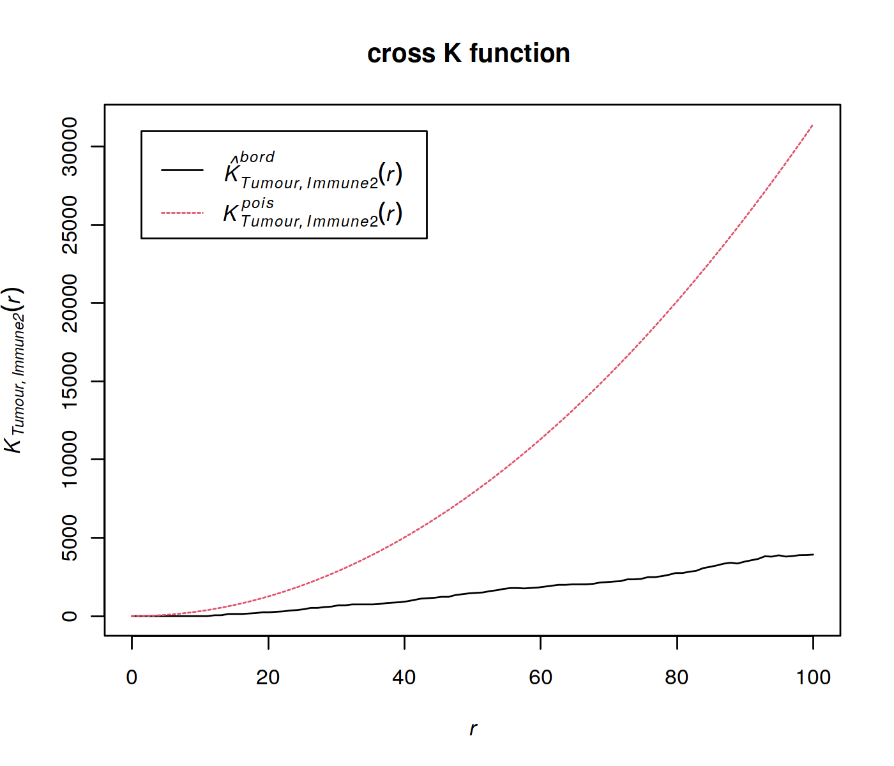

# Testing SPIAT v1.0.0 in R-4.2.2

I-Hsuan Lin

University of Manchester

January 19, 2023


## Spatial Image Analysis of Tissues

Bioconductor URL: https://bioconductor.org/packages/SPIAT/

SPIAT (**Sp**atial **I**mage **A**nalysis of **T**issues) is an R package with a suite of data processing, quality control, visualization and data analysis tools. SPIAT is compatible with data generated from single-cell spatial proteomics platforms (e.g. OPAL, CODEX, MIBI, cellprofiler). SPIAT reads spatial data in the form of X and Y coordinates of cells, marker intensities and cell phenotypes. SPIAT includes six analysis modules that allow visualization, calculation of cell colocalization, categorization of the immune microenvironment relative to tumor areas, analysis of cellular neighborhoods, and the quantification of spatial heterogeneity, providing a comprehensive toolkit for spatial data analysis.

**Content**

0. <a href="README.md#0-Prepare-workspace">Prepare workspace</a>
1. <a href="README.md#1-Reading-in-data-and-data-formatting-in-SPIAT">Reading in data and data formatting in SPIAT</a>
2. <a href="README.md#2-Quality-control-and-visualisation-with-SPIAT">Quality control and visualisation with SPIAT</a>
3. <a href="README.md#3-Basic-analyses-with-SPIAT">Basic analyses with SPIAT</a>
4. <a href="README.md#4-Quantifying-cell-colocalisation-with-SPIAT">Quantifying cell colocalisation with SPIAT</a>
5. <a href="README.md#5-Spatial-heterogeneity-with-SPIAT">Spatial heterogeneity with SPIAT</a>
6. <a href="README.md#6-Characterising-tissue-structure-with-SPIAT">Characterising tissue structure with SPIAT</a>
7. <a href="README.md#7-Identifying-cellular-neighborhood-with-SPIAT">Identifying cellular neighborhood with SPIAT</a>

# 0. Prepare workspace

<div class="alert alert-info">
    <b>1. Set up conda environment</b>
    <br />
    <code>mamba create -n SPIAT -c conda-forge -c bioconda jupyterlab nb_conda_kernels r-base=4.2 r-irkernel r-devtools r-cowplot bioconductor-spiat</code>
    <br />
    <br />
    <b>2. Activate conda environment</b>
    <br />
    <code>conda activate SPIAT</code>
    <br />
    <br />
    <b>3. Install scRUtils package in SPIAT env to use the <code>fig</code> function</b>
    <br />
    <code>mamba install -c conda-forge bioconductor-bluster bioconductor-scater</code>
    <br />
    <code>(in R) devtools::install_github("ycl6/scRUtils")</code>
</div>

## Load packages and demo data


```R
suppressPackageStartupMessages({
    library(SPIAT)
    library(scRUtils) # To use fig()
})

# Set output window width
options(width = 110) # default 80; getOption("width")
```

### `simulated_image`

A `SpatialExperiment` object of a formatted image (simulated by `spaSim` package). It has: 
- cell ids and phenotypes in `colData()`
- cell coordinates in `spatialCoords()`
- marker intensities in `assays()`


```R
data("simulated_image")
simulated_image
```


    class: SpatialExperiment 
    dim: 5 4951 
    metadata(0):
    assays(1): ''
    rownames(5): Tumour_marker Immune_marker1 Immune_marker2 Immune_marker3 Immune_marker4
    rowData names(0):
    colnames(4951): Cell_1 Cell_2 ... Cell_4950 Cell_4951
    colData names(2): Phenotype sample_id
    reducedDimNames(0):
    mainExpName: NULL
    altExpNames(0):
    spatialCoords names(2) : Cell.X.Position Cell.Y.Position
    imgData names(0):


### `image_no_markers`

A `SpatialExperiment` object of a formatted image without marker intensities (simulated by `spaSim` package). It has:
- cell ids and cell types in `colData()`
- cell coordinates in `spatialCoords()`


```R
data("image_no_markers")
image_no_markers
```


    class: SpatialExperiment 
    dim: 1 4951 
    metadata(0):
    assays(1): ''
    rownames(1): pseudo
    rowData names(0):
    colnames(4951): Cell_1 Cell_2 ... Cell_4950 Cell_4951
    colData names(3): Cell.Type Cell.Size sample_id
    reducedDimNames(0):
    mainExpName: NULL
    altExpNames(0):
    spatialCoords names(2) : Cell.X.Position Cell.Y.Position
    imgData names(0):


### `defined_image`

A `SpatialExperiment` object of a formatted image (simulated by `spaSim` package), with defined cell types based on marker combinations. It has: 

- cell ids, phenotypes, defined cell types in `colData()`
- cell coordinates in `spatialCoords()`
- marker intensities in `assays()`


```R
data("defined_image")
defined_image
```


    class: SpatialExperiment 
    dim: 5 4951 
    metadata(0):
    assays(1): ''
    rownames(5): Tumour_marker Immune_marker1 Immune_marker2 Immune_marker3 Immune_marker4
    rowData names(0):
    colnames(4951): Cell_1 Cell_2 ... Cell_4950 Cell_4951
    colData names(3): Phenotype sample_id Cell.Type
    reducedDimNames(0):
    mainExpName: NULL
    altExpNames(0):
    spatialCoords names(2) : Cell.X.Position Cell.Y.Position
    imgData names(1): sample_id


# 1. Reading in data and data formatting in SPIAT

## 1-1. Reading in data

### Reading in data through the ‘general’ option (RECOMMENDED)


```R
# Construct a dummy marker intensity matrix
# rows are markers, columns are cells
intensity_matrix <- matrix(c(14.557, 0.169, 1.655, 0.054, 
                             17.588, 0.229, 1.188, 2.074, 
                             21.262, 4.206,  5.924, 0.021), nrow = 4, ncol = 3)
# define marker names as rownames
rownames(intensity_matrix) <- c("DAPI", "CD3", "CD4", "AMACR")
# define cell IDs as colnames
colnames(intensity_matrix) <- c("Cell_1", "Cell_2", "Cell_3") 

# Construct a dummy metadata (phenotypes, x/y coordinates)
# the order of the elements in these vectors correspond to the cell order 
# in `intensity matrix`
phenotypes <- c("OTHER", "AMACR", "CD3,CD4")
coord_x <- c(82, 171, 184)
coord_y <- c(30, 22, 38)

general_format_image <- format_image_to_spe(format = "general", intensity_matrix = intensity_matrix,
                                            phenotypes = phenotypes, coord_x = coord_x,coord_y = coord_y)
```


```R
# phenotypes and cell properties (if available)
colData(general_format_image)

# cell coordinates
spatialCoords(general_format_image)

# marker intensities
assay(general_format_image)
```


    DataFrame with 3 rows and 3 columns
               Cell.ID   Phenotype   sample_id
           <character> <character> <character>
    Cell_1      Cell_1       OTHER    sample01
    Cell_2      Cell_2       AMACR    sample01
    Cell_3      Cell_3     CD3,CD4    sample01


<table class="dataframe">
<caption>A matrix: 3 × 2 of type dbl</caption>
<thead>
	<tr><th scope=col>Cell.X.Position</th><th scope=col>Cell.Y.Position</th></tr>
</thead>
<tbody>
	<tr><td> 82</td><td>30</td></tr>
	<tr><td>171</td><td>22</td></tr>
	<tr><td>184</td><td>38</td></tr>
</tbody>
</table>


<table class="dataframe">
<caption>A matrix: 4 × 3 of type dbl</caption>
<thead>
	<tr><th></th><th scope=col>Cell_1</th><th scope=col>Cell_2</th><th scope=col>Cell_3</th></tr>
</thead>
<tbody>
	<tr><th scope=row>DAPI</th><td>14.557</td><td>17.588</td><td>21.262</td></tr>
	<tr><th scope=row>CD3</th><td> 0.169</td><td> 0.229</td><td> 4.206</td></tr>
	<tr><th scope=row>CD4</th><td> 1.655</td><td> 1.188</td><td> 5.924</td></tr>
	<tr><th scope=row>AMACR</th><td> 0.054</td><td> 2.074</td><td> 0.021</td></tr>
</tbody>
</table>


### Reading in data from inForm


```R
raw_inform_data <- system.file("extdata", "tiny_inform.txt.gz", package = "SPIAT")
markers <- c("DAPI", "CD3", "PD-L1", "CD4", "CD8", "AMACR")
locations <- c("Nucleus","Cytoplasm", "Membrane","Cytoplasm","Cytoplasm",
               "Cytoplasm") # The order is the same as `markers`.
formatted_image <- format_image_to_spe(format = "inForm", path = raw_inform_data, markers = markers, 
                                       locations = locations)
formatted_image
```

    Rows: 9 Columns: 206
    ── Column specification ───────────────────────────────────────────────────────────────────────────────────────────────────────────────────────────────────────────────────────────────
    Delimiter: "\t"
    chr  (13): Path, Sample Name, Tissue Category, Phenotype, Process Region ID, Distance from Process Region ...
    dbl (188): Cell ID, Cell X Position, Cell Y Position, Category Region ID, Nucleus Area (pixels), Nucleus C...
    lgl   (5): Total Cells, Tissue Category Area (pixels), Cell Density (per megapixel), Lab ID, inForm 2.4.66...
    
    ℹ Use `spec()` to retrieve the full column specification for this data.
    ℹ Specify the column types or set `show_col_types = FALSE` to quiet this message.


    class: SpatialExperiment 
    dim: 6 9 
    metadata(0):
    assays(1): ''
    rownames(6): DAPI CD3 ... CD8 AMACR
    rowData names(0):
    colnames(9): Cell_1 Cell_2 ... Cell_8 Cell_9
    colData names(7): Phenotype Cell.Area ... Cell.Axis.Ratio sample_id
    reducedDimNames(0):
    mainExpName: NULL
    altExpNames(0):
    spatialCoords names(2) : Cell.X.Position Cell.Y.Position
    imgData names(0):


```R
raw_inform_data <- system.file("extdata", "tiny_inform.txt.gz", package = "SPIAT")
markers <- c("DAPI", "CD3", "PD-L1", "CD4", "CD8", "AMACR")
intensity_columns_interest <- c(
    "Nucleus DAPI (DAPI) Mean (Normalized Counts, Total Weighting)",
    "Cytoplasm CD3 (Opal 520) Mean (Normalized Counts, Total Weighting)", 
    "Membrane PD-L1 (Opal 540) Mean (Normalized Counts, Total Weighting)",
    "Cytoplasm CD4 (Opal 620) Mean (Normalized Counts, Total Weighting)",
    "Cytoplasm CD8 (Opal 650) Mean (Normalized Counts, Total Weighting)", 
    "Cytoplasm AMACR (Opal 690) Mean (Normalized Counts, Total Weighting)") # The order is the same as `markers`.
formatted_image <- format_inform_to_spe(path = raw_inform_data, markers = markers, 
                                        intensity_columns_interest = intensity_columns_interest)
formatted_image
```

    Rows: 9 Columns: 206
    ── Column specification ───────────────────────────────────────────────────────────────────────────────────────────────────────────────────────────────────────────────────────────────
    Delimiter: "\t"
    chr  (13): Path, Sample Name, Tissue Category, Phenotype, Process Region ID, Distance from Process Region ...
    dbl (188): Cell ID, Cell X Position, Cell Y Position, Category Region ID, Nucleus Area (pixels), Nucleus C...
    lgl   (5): Total Cells, Tissue Category Area (pixels), Cell Density (per megapixel), Lab ID, inForm 2.4.66...
    
    ℹ Use `spec()` to retrieve the full column specification for this data.
    ℹ Specify the column types or set `show_col_types = FALSE` to quiet this message.


    class: SpatialExperiment 
    dim: 6 9 
    metadata(0):
    assays(1): ''
    rownames(6): DAPI CD3 ... CD8 AMACR
    rowData names(0):
    colnames(9): Cell_1 Cell_2 ... Cell_8 Cell_9
    colData names(7): Phenotype Cell.Area ... Cell.Axis.Ratio sample_id
    reducedDimNames(0):
    mainExpName: NULL
    altExpNames(0):
    spatialCoords names(2) : Cell.X.Position Cell.Y.Position
    imgData names(0):


```R
dim(colData(formatted_image))

dim(assay(formatted_image))
```


<style>
.list-inline {list-style: none; margin:0; padding: 0}
.list-inline>li {display: inline-block}
.list-inline>li:not(:last-child)::after {content: "\00b7"; padding: 0 .5ex}
</style>
<ol class=list-inline><li>9</li><li>7</li></ol>


<style>
.list-inline {list-style: none; margin:0; padding: 0}
.list-inline>li {display: inline-block}
.list-inline>li:not(:last-child)::after {content: "\00b7"; padding: 0 .5ex}
</style>
<ol class=list-inline><li>6</li><li>9</li></ol>


### Reading in data from HALO


```R
raw_halo_data <- system.file("extdata", "tiny_halo.csv.gz", package = "SPIAT")
markers <- c("DAPI", "CD3", "PD-L1", "CD4", "CD8", "AMACR")
intensity_columns_interest <- c("Dye 1 Nucleus Intensity", "Dye 2 Cytoplasm Intensity",
                                "Dye 3 Membrane Intensity", "Dye 4 Cytoplasm Intensity",
                                "Dye 5 Cytoplasm Intensity", "Dye 6 Cytoplasm Intensity")
dye_columns_interest <- c("Dye 1 Positive Nucleus", "Dye 2 Positive Cytoplasm",
                          "Dye 3 Positive Membrane", "Dye 4 Positive Cytoplasm",
                          "Dye 5 Positive Cytoplasm", "Dye 6 Positive Cytoplasm")
formatted_image <- format_halo_to_spe(path = raw_halo_data, markers = markers, 
                                      intensity_columns_interest = intensity_columns_interest, 
                                      dye_columns_interest = dye_columns_interest)
formatted_image
```

    Rows: 10 Columns: 71
    ── Column specification ───────────────────────────────────────────────────────────────────────────────────────────────────────────────────────────────────────────────────────────────
    Delimiter: ","
    chr  (3): Analysis Region, Analysis Inputs, Classifier Label
    dbl (65): Object Id, XMin, XMax, YMin, YMax, Dye 1 Positive, Dye 1 Positive Nucleus, Dye 1 Nucleus Intensi...
    lgl  (3): Image Location, Region Area (μm²), Region Perimeter (μm)
    
    ℹ Use `spec()` to retrieve the full column specification for this data.
    ℹ Specify the column types or set `show_col_types = FALSE` to quiet this message.


    class: SpatialExperiment 
    dim: 6 10 
    metadata(0):
    assays(1): ''
    rownames(6): DAPI CD3 ... CD8 AMACR
    rowData names(0):
    colnames(10): Cell_723 Cell_724 ... Cell_731 Cell_732
    colData names(5): Phenotype Nucleus.Area Cytoplasm.Area Cell.Area sample_id
    reducedDimNames(0):
    mainExpName: NULL
    altExpNames(0):
    spatialCoords names(2) : Cell.X.Position Cell.Y.Position
    imgData names(0):


```R
dim(colData(formatted_image))

dim(assay(formatted_image))
```


<style>
.list-inline {list-style: none; margin:0; padding: 0}
.list-inline>li {display: inline-block}
.list-inline>li:not(:last-child)::after {content: "\00b7"; padding: 0 .5ex}
</style>
<ol class=list-inline><li>10</li><li>5</li></ol>


<style>
.list-inline {list-style: none; margin:0; padding: 0}
.list-inline>li {display: inline-block}
.list-inline>li:not(:last-child)::after {content: "\00b7"; padding: 0 .5ex}
</style>
<ol class=list-inline><li>6</li><li>10</li></ol>


## 1-2. Inspecting the SpaitalExperiment object

### Structure of a SPIAT SpatialExperiment object


```R
simulated_image
```


    class: SpatialExperiment 
    dim: 5 4951 
    metadata(0):
    assays(1): ''
    rownames(5): Tumour_marker Immune_marker1 Immune_marker2 Immune_marker3 Immune_marker4
    rowData names(0):
    colnames(4951): Cell_1 Cell_2 ... Cell_4950 Cell_4951
    colData names(2): Phenotype sample_id
    reducedDimNames(0):
    mainExpName: NULL
    altExpNames(0):
    spatialCoords names(2) : Cell.X.Position Cell.Y.Position
    imgData names(0):


```R
assay(simulated_image)[, 1:5]
```


<table class="dataframe">
<caption>A matrix: 5 × 5 of type dbl</caption>
<thead>
	<tr><th></th><th scope=col>Cell_1</th><th scope=col>Cell_2</th><th scope=col>Cell_3</th><th scope=col>Cell_4</th><th scope=col>Cell_5</th></tr>
</thead>
<tbody>
	<tr><th scope=row>Tumour_marker</th><td>4.466925e-01</td><td>1.196802e-04</td><td>0.235435887</td><td>1.125552e-01</td><td>1.600443e-02</td></tr>
	<tr><th scope=row>Immune_marker1</th><td>1.143640e-05</td><td>4.360881e-19</td><td>0.120582510</td><td>2.031554e-13</td><td>1.685832e-01</td></tr>
	<tr><th scope=row>Immune_marker2</th><td>1.311175e-15</td><td>5.678623e-02</td><td>0.115769761</td><td>5.840184e-12</td><td>9.025254e-05</td></tr>
	<tr><th scope=row>Immune_marker3</th><td>6.342341e-09</td><td>2.862823e-06</td><td>0.053107792</td><td>6.289501e-04</td><td>4.912962e-13</td></tr>
	<tr><th scope=row>Immune_marker4</th><td>2.543406e-04</td><td>4.702311e-04</td><td>0.005878394</td><td>4.582812e-03</td><td>2.470984e-03</td></tr>
</tbody>
</table>


```R
colData(simulated_image)[1:5, ]
```


    DataFrame with 5 rows and 2 columns
             Phenotype   sample_id
           <character> <character>
    Cell_1       OTHER    sample01
    Cell_2       OTHER    sample01
    Cell_3       OTHER    sample01
    Cell_4       OTHER    sample01
    Cell_5       OTHER    sample01


```R
spatialCoords(simulated_image)[1:5, ]
```


<table class="dataframe">
<caption>A matrix: 5 × 2 of type dbl</caption>
<thead>
	<tr><th></th><th scope=col>Cell.X.Position</th><th scope=col>Cell.Y.Position</th></tr>
</thead>
<tbody>
	<tr><th scope=row>Cell_1</th><td>139.77484</td><td> 86.704079</td></tr>
	<tr><th scope=row>Cell_2</th><td> 77.86721</td><td> 80.096527</td></tr>
	<tr><th scope=row>Cell_3</th><td> 84.44626</td><td> 19.238638</td></tr>
	<tr><th scope=row>Cell_4</th><td>110.19857</td><td>  5.656004</td></tr>
	<tr><th scope=row>Cell_5</th><td>167.89558</td><td>171.926407</td></tr>
</tbody>
</table>


```R
cbind(sort(table(simulated_image$Phenotype)))
```


<table class="dataframe">
<caption>A matrix: 5 × 1 of type int</caption>
<tbody>
	<tr><th scope=row>Immune_marker1,Immune_marker3</th><td> 178</td></tr>
	<tr><th scope=row>Immune_marker1,Immune_marker2</th><td> 338</td></tr>
	<tr><th scope=row>Immune_marker1,Immune_marker2,Immune_marker4</th><td> 630</td></tr>
	<tr><th scope=row>Tumour_marker</th><td> 819</td></tr>
	<tr><th scope=row>OTHER</th><td>2986</td></tr>
</tbody>
</table>


### Splitting images


```R
split_image <- image_splitter(simulated_image, number_of_splits = 3, plot = FALSE)

class(split_image)
names(split_image)
```


'list'


<style>
.list-inline {list-style: none; margin:0; padding: 0}
.list-inline>li {display: inline-block}
.list-inline>li:not(:last-child)::after {content: "\00b7"; padding: 0 .5ex}
</style>
<ol class=list-inline><li>'simulated_imager1c1'</li><li>'simulated_imager2c1'</li><li>'simulated_imager3c1'</li><li>'simulated_imager1c2'</li><li>'simulated_imager2c2'</li><li>'simulated_imager3c2'</li><li>'simulated_imager1c3'</li><li>'simulated_imager2c3'</li><li>'simulated_imager3c3'</li></ol>


### Predicting cell phenotypes


```R
fig(width = 5, height = 5, res = 200)
predicted_image <- predict_phenotypes(spe_object = simulated_image, thresholds = NULL,
                                      tumour_marker = "Tumour_marker",
                                      baseline_markers = c("Immune_marker1", "Immune_marker2", 
                                                           "Immune_marker3", "Immune_marker4"),
                                      reference_phenotypes = TRUE)
```

    [1] "Tumour_marker"
    [1] "Immune_marker1"
    [1] "Immune_marker2"
    [1] "Immune_marker3"
    [1] "Immune_marker4"


    

    


```R
fig(width = 10, height = 4, res = 200)
marker_prediction_plot(predicted_image, marker = "Immune_marker1")
```


    

    


```R
fig(width = 5, height = 5, res = 200)
predicted_image2 <- predict_phenotypes(spe_object = simulated_image, thresholds = NULL, 
                                       tumour_marker = "Tumour_marker", 
                                       baseline_markers = c("Immune_marker1", "Immune_marker2", 
                                                            "Immune_marker3", "Immune_marker4"), 
                                       reference_phenotypes = FALSE)
```

    [1] "Tumour_marker  threshold intensity:  0.445450443784465"
    [1] "Immune_marker1  threshold intensity:  0.116980867970434"
    [1] "Immune_marker2  threshold intensity:  0.124283809517202"
    [1] "Immune_marker3  threshold intensity:  0.0166413130263845"
    [1] "Immune_marker4  threshold intensity:  0.00989731350898589"


    

    


### Specifying cell types


```R
formatted_image <- define_celltypes(
    simulated_image, 
    categories = c("Tumour_marker","Immune_marker1,Immune_marker2", "Immune_marker1,Immune_marker3", 
                   "Immune_marker1,Immune_marker2,Immune_marker4", "OTHER"), 
    category_colname = "Phenotype", 
    names = c("Tumour", "Immune1", "Immune2", "Immune3", "Others"),
    new_colname = "Cell.Type")
```

# 2. Quality control and visualisation with SPIAT

## 2-1. Visualise marker levels

### Boxplots of marker intensities


```R
fig(width = 3, height = 3, res = 250)
marker_intensity_boxplot(formatted_image, "Immune_marker1")
```


    

    


### Scatter plots of marker levels


```R
fig(width = 6.5, height = 3.5, res = 200)
plot_cell_marker_levels(formatted_image, "Immune_marker1")
```


    

    


### Heatmaps of marker levels


```R
fig(width = 6, height = 4.5, res = 200)
plot_marker_level_heatmap(formatted_image, num_splits = 100, "Tumour_marker")
```


    

    


## 2-2. Identifying incorrect phenotypes

### Removing cells with incorrect phenotypes


```R
data_subset <- select_celltypes(
    formatted_image, keep = TRUE, 
    celltypes = c("Tumour_marker","Immune_marker1,Immune_marker3", "Immune_marker1,Immune_marker2", 
                  "Immune_marker1,Immune_marker2,Immune_marker4"), 
    feature_colname = "Phenotype")

# have a look at what phenotypes are present
unique(data_subset$Phenotype)
```


<style>
.list-inline {list-style: none; margin:0; padding: 0}
.list-inline>li {display: inline-block}
.list-inline>li:not(:last-child)::after {content: "\00b7"; padding: 0 .5ex}
</style>
<ol class=list-inline><li>'Immune_marker1,Immune_marker2'</li><li>'Tumour_marker'</li><li>'Immune_marker1,Immune_marker2,Immune_marker4'</li><li>'Immune_marker1,Immune_marker3'</li></ol>


### Dimensionality reduction to identify misclassified cells


```R
# First predict the phenotypes (this is for generating not 100% accurate phenotypes)
fig(width = 5, height = 5, res = 200)
predicted_image2 <- predict_phenotypes(spe_object = simulated_image, thresholds = NULL, 
                                       tumour_marker = "Tumour_marker", 
                                       baseline_markers = c("Immune_marker1", "Immune_marker2", 
                                                            "Immune_marker3", "Immune_marker4"), 
                                       reference_phenotypes = FALSE)
```

    [1] "Tumour_marker  threshold intensity:  0.445450443784465"
    [1] "Immune_marker1  threshold intensity:  0.116980867970434"
    [1] "Immune_marker2  threshold intensity:  0.124283809517202"
    [1] "Immune_marker3  threshold intensity:  0.0166413130263845"
    [1] "Immune_marker4  threshold intensity:  0.00989731350898589"


    

    


```R
# Then define the cell types based on predicted phenotypes
predicted_image2 <- define_celltypes(predicted_image2, 
                                     categories = c("Tumour_marker", "Immune_marker1,Immune_marker2", 
                                                    "Immune_marker1,Immune_marker3", 
                                                    "Immune_marker1,Immune_marker2,Immune_marker4"), 
                                     category_colname = "Phenotype", 
                                     names = c("Tumour", "Immune1", "Immune2",  "Immune3"), 
                                     new_colname = "Cell.Type")

# Delete cells with unrealistic marker combinations from the dataset
predicted_image2 <- select_celltypes(predicted_image2, "Undefined", feature_colname = "Cell.Type", keep = FALSE)

# TSNE plot
fig(width = 5, height = 4, res = 200)
dimensionality_reduction_plot(predicted_image2, plot_type = "TSNE", feature_colname = "Cell.Type")
```


    

    


```R
predicted_image2 <- select_celltypes(predicted_image2, c("Cell_3302", "Cell_4917", "Cell_2297", "Cell_488", 
                                                         "Cell_4362", "Cell_4801", "Cell_2220", "Cell_3431", 
                                                         "Cell_533", "Cell_4925", "Cell_4719", "Cell_469", 
                                                         "Cell_1929", "Cell_310", "Cell_2536", "Cell_321", 
                                                         "Cell_4195"), feature_colname = "Cell.ID", keep = FALSE)

fig(width = 5, height = 4, res = 200)
dimensionality_reduction_plot(predicted_image2, plot_type = "TSNE", feature_colname = "Cell.Type")
```


    

    


## 2-3. Visualising tissues

### Categorical dot plot


```R
my_colors <- c("red", "blue", "darkcyan", "darkgreen")
  
fig(width = 6, height = 4.5, res = 200)
plot_cell_categories(spe_object = formatted_image, 
                     categories_of_interest = c("Tumour", "Immune1", "Immune2", "Immune3"), 
                     colour_vector = my_colors, feature_colname = "Cell.Type")
```


    

    


### 3D surface plot


```R
marker_surface_plot(formatted_image, num_splits = 15, marker = "Immune_marker1")
```


### 3D stacked surface plot


```R
marker_surface_plot_stack(formatted_image, num_splits = 15, markers = c("Tumour_marker", "Immune_marker1"))
```


# 3. Basic analyses with SPIAT


## 3-1. Cell percentages


```R
fig(width = 6, height = 4.5, res = 200)
plot_cell_categories(spe_object = formatted_image, 
                     categories_of_interest = c("Tumour", "Immune1", "Immune2", "Immune3"), 
                     colour_vector = my_colors, feature_colname = "Cell.Type")
```


    

    


```R
fig(width = 4, height = 4, res = 200)
p_cells <- calculate_cell_proportions(formatted_image, reference_celltypes = NULL, feature_colname ="Cell.Type", 
                                      celltypes_to_exclude = "Others", plot.image = TRUE)
```


    

    


```R
p_cells
```


<table class="dataframe">
<caption>A data.frame: 4 × 5</caption>
<thead>
	<tr><th></th><th scope=col>Cell_type</th><th scope=col>Number_of_celltype</th><th scope=col>Proportion</th><th scope=col>Percentage</th><th scope=col>Proportion_name</th></tr>
	<tr><th></th><th scope=col>&lt;fct&gt;</th><th scope=col>&lt;int&gt;</th><th scope=col>&lt;dbl&gt;</th><th scope=col>&lt;dbl&gt;</th><th scope=col>&lt;chr&gt;</th></tr>
</thead>
<tbody>
	<tr><th scope=row>5</th><td>Tumour </td><td>819</td><td>0.41679389</td><td>41.679389</td><td>/Total</td></tr>
	<tr><th scope=row>3</th><td>Immune3</td><td>630</td><td>0.32061069</td><td>32.061069</td><td>/Total</td></tr>
	<tr><th scope=row>1</th><td>Immune1</td><td>338</td><td>0.17201018</td><td>17.201018</td><td>/Total</td></tr>
	<tr><th scope=row>2</th><td>Immune2</td><td>178</td><td>0.09058524</td><td> 9.058524</td><td>/Total</td></tr>
</tbody>
</table>


```R
fig(width = 6, height = 1.6, res = 250)
plot_cell_percentages(cell_proportions = p_cells, cells_to_exclude = "Tumour", cellprop_colname = "Proportion_name")
```


    

    


    

    


    

    


## 3-2. Cell distances

### Pairwise cell distances


```R
distances <- calculate_pairwise_distances_between_celltypes(
    spe_object = formatted_image, 
    cell_types_of_interest = c("Tumour", "Immune1", "Immune3"), 
    feature_colname = "Cell.Type")

head(distances)
```


<table class="dataframe">
<caption>A data.frame: 6 × 6</caption>
<thead>
	<tr><th></th><th scope=col>Cell1</th><th scope=col>Cell2</th><th scope=col>Distance</th><th scope=col>Type1</th><th scope=col>Type2</th><th scope=col>Pair</th></tr>
	<tr><th></th><th scope=col>&lt;fct&gt;</th><th scope=col>&lt;fct&gt;</th><th scope=col>&lt;dbl&gt;</th><th scope=col>&lt;chr&gt;</th><th scope=col>&lt;chr&gt;</th><th scope=col>&lt;chr&gt;</th></tr>
</thead>
<tbody>
	<tr><th scope=row>2</th><td>Cell_25</td><td>Cell_15</td><td>119.39827</td><td>Immune1</td><td>Immune1</td><td>Immune1/Immune1</td></tr>
	<tr><th scope=row>3</th><td>Cell_30</td><td>Cell_15</td><td> 61.77859</td><td>Immune1</td><td>Immune1</td><td>Immune1/Immune1</td></tr>
	<tr><th scope=row>4</th><td>Cell_48</td><td>Cell_15</td><td>279.84944</td><td>Immune1</td><td>Immune1</td><td>Immune1/Immune1</td></tr>
	<tr><th scope=row>5</th><td>Cell_56</td><td>Cell_15</td><td>237.67335</td><td>Immune1</td><td>Immune1</td><td>Immune1/Immune1</td></tr>
	<tr><th scope=row>6</th><td>Cell_61</td><td>Cell_15</td><td>335.22489</td><td>Immune1</td><td>Immune1</td><td>Immune1/Immune1</td></tr>
	<tr><th scope=row>7</th><td>Cell_71</td><td>Cell_15</td><td>342.60619</td><td>Immune1</td><td>Immune1</td><td>Immune1/Immune1</td></tr>
</tbody>
</table>


```R
fig(width = 6, height = 5, res = 200)
plot_cell_distances_violin(distances)
```


    

    


```R
summary_distances <- calculate_summary_distances_between_celltypes(distances)
summary_distances
```


<table class="dataframe">
<caption>A data.frame: 9 × 8</caption>
<thead>
	<tr><th scope=col>Pair</th><th scope=col>Mean</th><th scope=col>Min</th><th scope=col>Max</th><th scope=col>Median</th><th scope=col>Std.Dev</th><th scope=col>Reference</th><th scope=col>Target</th></tr>
	<tr><th scope=col>&lt;chr&gt;</th><th scope=col>&lt;dbl&gt;</th><th scope=col>&lt;dbl&gt;</th><th scope=col>&lt;dbl&gt;</th><th scope=col>&lt;dbl&gt;</th><th scope=col>&lt;dbl&gt;</th><th scope=col>&lt;chr&gt;</th><th scope=col>&lt;chr&gt;</th></tr>
</thead>
<tbody>
	<tr><td>Immune1/Immune1</td><td>1164.7096</td><td>10.84056</td><td>2729.120</td><td>1191.3645</td><td>552.0154</td><td>Immune1</td><td>Immune1</td></tr>
	<tr><td>Immune1/Immune3</td><td>1034.4960</td><td>10.23688</td><td>2691.514</td><td>1026.4414</td><td>442.2515</td><td>Immune1</td><td>Immune3</td></tr>
	<tr><td>Immune1/Tumour </td><td>1013.3697</td><td>13.59204</td><td>2708.343</td><td>1004.6579</td><td>413.7815</td><td>Immune1</td><td>Tumour </td></tr>
	<tr><td>Immune3/Immune1</td><td>1034.4960</td><td>10.23688</td><td>2691.514</td><td>1026.4414</td><td>442.2515</td><td>Immune3</td><td>Immune1</td></tr>
	<tr><td>Immune3/Immune3</td><td> 794.7765</td><td>10.17353</td><td>2645.302</td><td> 769.9948</td><td>397.8863</td><td>Immune3</td><td>Immune3</td></tr>
	<tr><td>Immune3/Tumour </td><td> 758.2732</td><td>10.02387</td><td>2670.861</td><td> 733.4501</td><td>380.7703</td><td>Immune3</td><td>Tumour </td></tr>
	<tr><td>Tumour/Immune1 </td><td>1013.3697</td><td>13.59204</td><td>2708.343</td><td>1004.6579</td><td>413.7815</td><td>Tumour </td><td>Immune1</td></tr>
	<tr><td>Tumour/Immune3 </td><td> 758.2732</td><td>10.02387</td><td>2670.861</td><td> 733.4501</td><td>380.7703</td><td>Tumour </td><td>Immune3</td></tr>
	<tr><td>Tumour/Tumour  </td><td> 711.2657</td><td>10.00348</td><td>2556.332</td><td> 703.9096</td><td>380.3293</td><td>Tumour </td><td>Tumour </td></tr>
</tbody>
</table>


```R
fig(width = 4, height = 3, res = 250)
plot_distance_heatmap(phenotype_distances_result = summary_distances, metric = "mean")
```


    

    


### Minimum cell distances


```R
min_dist <- calculate_minimum_distances_between_celltypes(
    spe_object = formatted_image, 
    cell_types_of_interest = c("Tumour", "Immune1", "Immune2","Immune3", "Others"), 
    feature_colname = "Cell.Type")

head(min_dist)
```

    [1] "Markers had been selected in minimum distance calculation: "
    [1] "Others"  "Immune1" "Tumour"  "Immune3" "Immune2"


<table class="dataframe">
<caption>A data.frame: 6 × 6</caption>
<thead>
	<tr><th></th><th scope=col>RefCell</th><th scope=col>RefType</th><th scope=col>NearestCell</th><th scope=col>NearestType</th><th scope=col>Distance</th><th scope=col>Pair</th></tr>
	<tr><th></th><th scope=col>&lt;chr&gt;</th><th scope=col>&lt;chr&gt;</th><th scope=col>&lt;chr&gt;</th><th scope=col>&lt;chr&gt;</th><th scope=col>&lt;dbl&gt;</th><th scope=col>&lt;chr&gt;</th></tr>
</thead>
<tbody>
	<tr><th scope=row>2</th><td>Cell_1</td><td>Others</td><td>Cell_25</td><td>Immune1</td><td>43.71654</td><td>Others/Immune1</td></tr>
	<tr><th scope=row>3</th><td>Cell_2</td><td>Others</td><td>Cell_30</td><td>Immune1</td><td>36.55302</td><td>Others/Immune1</td></tr>
	<tr><th scope=row>4</th><td>Cell_3</td><td>Others</td><td>Cell_15</td><td>Immune1</td><td>25.31203</td><td>Others/Immune1</td></tr>
	<tr><th scope=row>5</th><td>Cell_4</td><td>Others</td><td>Cell_15</td><td>Immune1</td><td>11.48572</td><td>Others/Immune1</td></tr>
	<tr><th scope=row>6</th><td>Cell_5</td><td>Others</td><td>Cell_25</td><td>Immune1</td><td>46.02692</td><td>Others/Immune1</td></tr>
	<tr><th scope=row>7</th><td>Cell_6</td><td>Others</td><td>Cell_56</td><td>Immune1</td><td>89.81042</td><td>Others/Immune1</td></tr>
</tbody>
</table>


```R
fig(width = 7, height = 6, res = 200)
plot_cell_distances_violin(cell_to_cell_dist = min_dist)
```


    

    


```R
min_summary_dist <- calculate_summary_distances_between_celltypes(min_dist)
head(min_summary_dist)
```


<table class="dataframe">
<caption>A data.frame: 6 × 8</caption>
<thead>
	<tr><th></th><th scope=col>Pair</th><th scope=col>Mean</th><th scope=col>Min</th><th scope=col>Max</th><th scope=col>Median</th><th scope=col>Std.Dev</th><th scope=col>Reference</th><th scope=col>Target</th></tr>
	<tr><th></th><th scope=col>&lt;chr&gt;</th><th scope=col>&lt;dbl&gt;</th><th scope=col>&lt;dbl&gt;</th><th scope=col>&lt;dbl&gt;</th><th scope=col>&lt;dbl&gt;</th><th scope=col>&lt;dbl&gt;</th><th scope=col>&lt;chr&gt;</th><th scope=col>&lt;chr&gt;</th></tr>
</thead>
<tbody>
	<tr><th scope=row>1</th><td>Immune1/Immune2</td><td>63.65211</td><td>10.33652</td><td>158.80504</td><td>59.01846</td><td>32.58482</td><td>Immune1</td><td>Immune2</td></tr>
	<tr><th scope=row>2</th><td>Immune1/Immune3</td><td>88.46152</td><td>10.23688</td><td>256.30328</td><td>77.21765</td><td>53.73164</td><td>Immune1</td><td>Immune3</td></tr>
	<tr><th scope=row>3</th><td>Immune1/Others </td><td>19.24038</td><td>10.05203</td><td> 49.86409</td><td>17.49196</td><td> 7.19293</td><td>Immune1</td><td>Others </td></tr>
	<tr><th scope=row>4</th><td>Immune1/Tumour </td><td>85.84773</td><td>13.59204</td><td>223.15809</td><td>80.80592</td><td>40.72454</td><td>Immune1</td><td>Tumour </td></tr>
	<tr><th scope=row>5</th><td>Immune2/Immune1</td><td>48.45885</td><td>10.33652</td><td>132.31086</td><td>43.71936</td><td>27.43245</td><td>Immune2</td><td>Immune1</td></tr>
	<tr><th scope=row>6</th><td>Immune2/Immune3</td><td>91.58174</td><td>10.72629</td><td>293.43664</td><td>79.11299</td><td>56.11624</td><td>Immune2</td><td>Immune3</td></tr>
</tbody>
</table>


```R
fig(width = 4, height = 3, res = 250)
plot_distance_heatmap(phenotype_distances_result = min_summary_dist, metric = "mean")
```


    

    


# 4. Quantifying cell colocalisation with SPIAT

## 4-1. Cells In Neighbourhood (CIN)


```R
average_percentage_of_cells_within_radius(spe_object = formatted_image, reference_celltype = "Immune1", 
                                          target_celltype = "Immune2", radius = 100, feature_colname = "Cell.Type")
```


4.76812294767839


```R
average_marker_intensity_within_radius(spe_object = formatted_image, reference_marker = "Immune_marker3", 
                                       target_marker = "Immune_marker2", radius=30)
```


0.599535682477406


```R
fig(width = 7.5, height = 3, res = 200)
plot_average_intensity(spe_object = formatted_image, reference_marker = "Immune_marker3", 
                       target_marker = "Immune_marker2", radii = c(30, 35, 40, 45, 50, 75, 100))
```


    

    


## 4-2. Mixing Score (MS) and Normalised Mixing Score (NMS)


```R
mixing_score_summary(spe_object = formatted_image, reference_celltype = "Immune1", 
                     target_celltype = "Immune2", radius = 100, feature_colname = "Cell.Type")
```


<table class="dataframe">
<caption>A data.frame: 1 × 8</caption>
<thead>
	<tr><th></th><th scope=col>Reference</th><th scope=col>Target</th><th scope=col>Number_of_reference_cells</th><th scope=col>Number_of_target_cells</th><th scope=col>Reference_target_interaction</th><th scope=col>Reference_reference_interaction</th><th scope=col>Mixing_score</th><th scope=col>Normalised_mixing_score</th></tr>
	<tr><th></th><th scope=col>&lt;chr&gt;</th><th scope=col>&lt;chr&gt;</th><th scope=col>&lt;dbl&gt;</th><th scope=col>&lt;dbl&gt;</th><th scope=col>&lt;dbl&gt;</th><th scope=col>&lt;dbl&gt;</th><th scope=col>&lt;dbl&gt;</th><th scope=col>&lt;dbl&gt;</th></tr>
</thead>
<tbody>
	<tr><th scope=row>2</th><td>Immune1</td><td>Immune2</td><td>338</td><td>178</td><td>583</td><td>1184</td><td>0.4923986</td><td>1.864476</td></tr>
</tbody>
</table>


## 4-3. Cross K function


```R
fig(width = 7, height = 6, res = 200)
df_cross <- calculate_cross_functions(formatted_image, method = "Kcross", 
                                      cell_types_of_interest = c("Tumour","Immune2"), 
                                      feature_colname = "Cell.Type", dist = 100)
```


    

    


```R
AUC_of_cross_function(df_cross)
```


-0.283673515874936


## 4-4. Cross-K Intersection (CKI)


```R
fig(width = 7, height = 6, res = 200)
df_cross <- calculate_cross_functions(formatted_image, method = "Kcross", 
                                      cell_types_of_interest = c("Tumour","Immune3"), 
                                      feature_colname = "Cell.Type", dist = 100)
```


    

    


# 5. Spatial heterogeneity with SPIAT

## 5-1. Localised Entropy


```R
calculate_entropy(formatted_image, cell_types_of_interest = c("Immune1","Immune2"), feature_colname = "Cell.Type")
```


0.929487332602717


### Fishnet grid


```R
fig(width = 4.5, height = 4, res = 200)
grid <- grid_metrics(defined_image, FUN = calculate_entropy, n_split = 20, 
                     cell_types_of_interest = c("Tumour","Immune3"), feature_colname = "Cell.Type")
```


    

    


```R
calculate_percentage_of_grids(grid, threshold = 0.75, above = TRUE)

calculate_spatial_autocorrelation(grid, metric = "globalmoran")
```


13


0.0944696431369536


## 5-2. Gradients (based on concentric circles)


```R
gradient_positions <- c(30, 50, 100)
gradient_entropy <- compute_gradient(defined_image, radii = gradient_positions, 
                                     FUN = calculate_entropy,  cell_types_of_interest = c("Immune1","Immune2"), 
                                     feature_colname = "Cell.Type")
length(gradient_entropy)
```


3


```R
head(gradient_entropy[[1]])
```


<table class="dataframe">
<caption>A data.frame: 6 × 13</caption>
<thead>
	<tr><th></th><th scope=col>Cell.X.Position</th><th scope=col>Cell.Y.Position</th><th scope=col>Immune1</th><th scope=col>Immune2</th><th scope=col>total</th><th scope=col>Immune1_log2</th><th scope=col>Immune2_log2</th><th scope=col>total_log2</th><th scope=col>Immune1ratio</th><th scope=col>Immune1_entropy</th><th scope=col>Immune2ratio</th><th scope=col>Immune2_entropy</th><th scope=col>entropy</th></tr>
	<tr><th></th><th scope=col>&lt;dbl&gt;</th><th scope=col>&lt;dbl&gt;</th><th scope=col>&lt;int&gt;</th><th scope=col>&lt;int&gt;</th><th scope=col>&lt;dbl&gt;</th><th scope=col>&lt;dbl&gt;</th><th scope=col>&lt;dbl&gt;</th><th scope=col>&lt;dbl&gt;</th><th scope=col>&lt;dbl&gt;</th><th scope=col>&lt;dbl&gt;</th><th scope=col>&lt;dbl&gt;</th><th scope=col>&lt;dbl&gt;</th><th scope=col>&lt;dbl&gt;</th></tr>
</thead>
<tbody>
	<tr><th scope=row>Cell_15</th><td>109.67027</td><td> 17.12956</td><td>1</td><td>0</td><td>1</td><td>0</td><td>0</td><td>0</td><td>1</td><td>0</td><td>0</td><td>0</td><td>0</td></tr>
	<tr><th scope=row>Cell_25</th><td>153.22795</td><td>128.29915</td><td>1</td><td>0</td><td>1</td><td>0</td><td>0</td><td>0</td><td>1</td><td>0</td><td>0</td><td>0</td><td>0</td></tr>
	<tr><th scope=row>Cell_30</th><td> 57.29037</td><td> 49.88533</td><td>1</td><td>0</td><td>1</td><td>0</td><td>0</td><td>0</td><td>1</td><td>0</td><td>0</td><td>0</td><td>0</td></tr>
	<tr><th scope=row>Cell_48</th><td> 83.47798</td><td>295.75058</td><td>2</td><td>0</td><td>2</td><td>1</td><td>0</td><td>1</td><td>1</td><td>0</td><td>0</td><td>0</td><td>0</td></tr>
	<tr><th scope=row>Cell_56</th><td> 35.24227</td><td>242.84862</td><td>1</td><td>0</td><td>1</td><td>0</td><td>0</td><td>0</td><td>1</td><td>0</td><td>0</td><td>0</td><td>0</td></tr>
	<tr><th scope=row>Cell_61</th><td>156.39943</td><td>349.08154</td><td>2</td><td>0</td><td>2</td><td>1</td><td>0</td><td>1</td><td>1</td><td>0</td><td>0</td><td>0</td><td>0</td></tr>
</tbody>
</table>


```R
gradient_pos <- seq(50, 500, 50) ##radii
gradient_results <- entropy_gradient_aggregated(defined_image, cell_types_of_interest = c("Immune3","Tumour"),
                                                feature_colname = "Cell.Type", radii = gradient_pos)
# plot the results
fig(width = 5, height = 4, res = 200)
plot(1:10, gradient_results$gradient_df[1, 3:12])
```


    

    


# 6. Characterising tissue structure with SPIAT

## 6-1. Characterising the distribution of the cells of interest in identified tissue regions

### Determining whether there is a clear tumour margin


```R
fig(width = 5, height = 5, res = 200)
R_BC(formatted_image, cell_type_of_interest = "Tumour", "Cell.Type")
```


0.201465201465201


    

    


### Automatic identification of the tumour margin


```R
fig(width = 5, height = 5, res = 200)
formatted_border <- identify_bordering_cells(formatted_image, reference_cell = "Tumour", 
                                             feature_colname = "Cell.Type")
```

    [1] "The alpha of Polygon is: 63.24375"


    

    


```R
# Get the number of tumour clusters
attr(formatted_border, "n_of_clusters")
```


3


### Classification of cells based on their locations relative to the margin


```R
formatted_distance <- calculate_distance_to_margin(formatted_border)
```

    [1] "Markers had been selected in minimum distance calculation: "
    [1] "Non-border" "Border"    


```R
names_of_immune_cells <- c("Immune1", "Immune2","Immune3")

formatted_structure <- define_structure(formatted_distance, 
                                        cell_types_of_interest = names_of_immune_cells, 
                                        feature_colname = "Cell.Type", n_margin_layers = 5)

categories <- unique(formatted_structure$Structure)

fig(width = 6, height = 4.5, res = 200)
plot_cell_categories(formatted_structure, feature_colname = "Structure")
```


    

    


### Calculate the proportions of immune cells in each of the locations


```R
immune_proportions <- calculate_proportions_of_cells_in_structure(
    spe_object = formatted_structure, 
    cell_types_of_interest = names_of_immune_cells, 
    feature_colname = "Cell.Type")

immune_proportions
```


<table class="dataframe">
<caption>A data.frame: 10 × 6</caption>
<thead>
	<tr><th scope=col>Cell.Type</th><th scope=col>Relative_to</th><th scope=col>P.Infiltrated.CoI</th><th scope=col>P.Internal.Margin.CoI</th><th scope=col>P.External.Margin.CoI</th><th scope=col>P.Stromal.CoI</th></tr>
	<tr><th scope=col>&lt;chr&gt;</th><th scope=col>&lt;chr&gt;</th><th scope=col>&lt;dbl&gt;</th><th scope=col>&lt;dbl&gt;</th><th scope=col>&lt;dbl&gt;</th><th scope=col>&lt;dbl&gt;</th></tr>
</thead>
<tbody>
	<tr><td>Immune1              </td><td>All_cells_in_the_structure            </td><td>0.00000000</td><td>0.00000000</td><td>0.001733102</td><td>0.09658928</td></tr>
	<tr><td>Immune2              </td><td>All_cells_in_the_structure            </td><td>0.00000000</td><td>0.00000000</td><td>0.001733102</td><td>0.05073087</td></tr>
	<tr><td>Immune3              </td><td>All_cells_in_the_structure            </td><td>0.12576687</td><td>0.08071749</td><td>0.681109185</td><td>0.04585841</td></tr>
	<tr><td>Immune1              </td><td>All_cells_of_interest_in_the_structure</td><td>0.00000000</td><td>0.00000000</td><td>0.002531646</td><td>0.50000000</td></tr>
	<tr><td>Immune2              </td><td>All_cells_of_interest_in_the_structure</td><td>0.00000000</td><td>0.00000000</td><td>0.002531646</td><td>0.26261128</td></tr>
	<tr><td>Immune3              </td><td>All_cells_of_interest_in_the_structure</td><td>1.00000000</td><td>1.00000000</td><td>0.994936709</td><td>0.23738872</td></tr>
	<tr><td>Immune1              </td><td>The_same_cell_type_in_the_whole_image </td><td>0.00000000</td><td>0.00000000</td><td>0.002958580</td><td>0.99704142</td></tr>
	<tr><td>Immune2              </td><td>The_same_cell_type_in_the_whole_image </td><td>0.00000000</td><td>0.00000000</td><td>0.005617978</td><td>0.99438202</td></tr>
	<tr><td>Immune3              </td><td>The_same_cell_type_in_the_whole_image </td><td>0.06507937</td><td>0.05714286</td><td>0.623809524</td><td>0.25396825</td></tr>
	<tr><td>All_cells_of_interest</td><td>All_cells_in_the_structure            </td><td>0.14385965</td><td>0.08780488</td><td>2.170329670</td><td>0.23943162</td></tr>
</tbody>
</table>


### Calculate summaries of the distances for immune cells in the tumour structure


```R
immune_distances <- calculate_summary_distances_of_cells_to_borders(
    spe_object = formatted_structure, 
    cell_types_of_interest = names_of_immune_cells, 
    feature_colname = "Cell.Type")

immune_distances
```


<table class="dataframe">
<caption>A data.frame: 8 × 7</caption>
<thead>
	<tr><th scope=col>Cell.Type</th><th scope=col>Area</th><th scope=col>Min_d</th><th scope=col>Max_d</th><th scope=col>Mean_d</th><th scope=col>Median_d</th><th scope=col>St.dev_d</th></tr>
	<tr><th scope=col>&lt;chr&gt;</th><th scope=col>&lt;chr&gt;</th><th scope=col>&lt;dbl&gt;</th><th scope=col>&lt;dbl&gt;</th><th scope=col>&lt;dbl&gt;</th><th scope=col>&lt;dbl&gt;</th><th scope=col>&lt;dbl&gt;</th></tr>
</thead>
<tbody>
	<tr><td>All_cell_types_of_interest</td><td>Within_border_area</td><td>10.93225</td><td>192.4094</td><td> 86.20042</td><td> 88.23299</td><td> 45.27414</td></tr>
	<tr><td>All_cell_types_of_interest</td><td>Stroma            </td><td>10.02387</td><td>984.0509</td><td>218.11106</td><td>133.18220</td><td>199.87586</td></tr>
	<tr><td>Immune1                   </td><td>Within_border_area</td><td>      NA</td><td>      NA</td><td>       NA</td><td>       NA</td><td>       NA</td></tr>
	<tr><td>Immune1                   </td><td>Stroma            </td><td>84.20018</td><td>970.7749</td><td>346.14096</td><td>301.01535</td><td>187.04247</td></tr>
	<tr><td>Immune2                   </td><td>Within_border_area</td><td>      NA</td><td>      NA</td><td>       NA</td><td>       NA</td><td>       NA</td></tr>
	<tr><td>Immune2                   </td><td>Stroma            </td><td>79.42753</td><td>984.0509</td><td>333.26374</td><td>284.09062</td><td>185.67518</td></tr>
	<tr><td>Immune3                   </td><td>Within_border_area</td><td>10.93225</td><td>192.4094</td><td> 86.20042</td><td> 88.23299</td><td> 45.27414</td></tr>
	<tr><td>Immune3                   </td><td>Stroma            </td><td>10.02387</td><td>971.5638</td><td>102.79227</td><td> 68.19218</td><td>131.32714</td></tr>
</tbody>
</table>


# 7. Identifying cellular neighborhood with SPIAT

## 7-1. Cellular neighborhood


```R
fig(width = 6, height = 4.5, res = 200)
plot_cell_categories(
    image_no_markers, c("Tumour", "Immune","Immune1","Immune2","Others"), 
    c("red","blue","darkgreen", "brown","lightgray"), "Cell.Type")

average_minimum_distance(image_no_markers)
```


17.0133606995287


    

    


```R
fig(width = 4.5, height = 4.5, res = 225)
clusters <- identify_neighborhoods(
    image_no_markers, method = "hierarchical", min_neighborhood_size = 100, 
    cell_types_of_interest = c("Immune", "Immune1", "Immune2"), radius = 50, feature_colname = "Cell.Type")
```


    

    


```R
neighorhoods_vis <- composition_of_neighborhoods(clusters, feature_colname = "Cell.Type")
neighorhoods_vis <- neighorhoods_vis[neighorhoods_vis$Total_number_of_cells >= 5,]

fig(width = 4, height = 3.5, res = 250)
plot_composition_heatmap(neighorhoods_vis, feature_colname = "Cell.Type")
```


    

    


## 7-2. Average Nearest Neighbour Index (ANNI)


```R
average_nearest_neighbor_index(clusters, reference_celltypes = c("Cluster_1"), 
                               feature_colname = "Neighborhood", p_val = 0.05)
```


<dl>
	<dt>$ANN_index</dt>
		<dd>0.469660839884266</dd>
	<dt>$pattern</dt>
		<dd>'Clustered'</dd>
	<dt>$`p-value`</dt>
		<dd>2.62313154368373e-68</dd>
</dl>


```R
average_nearest_neighbor_index(image_no_markers, reference_celltypes = c("Immune", "Immune1" , "Immune2"), 
                               feature_colname = "Cell.Type", p_val = 0.05)
```


<dl>
	<dt>$ANN_index</dt>
		<dd>0.996857516169295</dd>
	<dt>$pattern</dt>
		<dd>'Random'</dd>
	<dt>$`p-value`</dt>
		<dd>0.400080571849076</dd>
</dl>


# Session Info


```R
sessionInfo()
```


    R version 4.2.2 (2022-10-31)
    Platform: x86_64-conda-linux-gnu (64-bit)
    Running under: Ubuntu 20.04.5 LTS
    
    Matrix products: default
    BLAS/LAPACK: /home/ihsuan/miniconda3/envs/SPIAT/lib/libopenblasp-r0.3.21.so
    
    locale:
     [1] LC_CTYPE=en_GB.UTF-8       LC_NUMERIC=C               LC_TIME=en_GB.UTF-8       
     [4] LC_COLLATE=en_GB.UTF-8     LC_MONETARY=en_GB.UTF-8    LC_MESSAGES=en_GB.UTF-8   
     [7] LC_PAPER=en_GB.UTF-8       LC_NAME=C                  LC_ADDRESS=C              
    [10] LC_TELEPHONE=C             LC_MEASUREMENT=en_GB.UTF-8 LC_IDENTIFICATION=C       
    
    attached base packages:
    [1] stats4    stats     graphics  grDevices utils     datasets  methods   base     
    
    other attached packages:
     [1] scRUtils_0.1.3              SPIAT_1.0.0                 SpatialExperiment_1.8.0    
     [4] SingleCellExperiment_1.20.0 SummarizedExperiment_1.28.0 Biobase_2.58.0             
     [7] GenomicRanges_1.50.0        GenomeInfoDb_1.34.1         IRanges_2.32.0             
    [10] S4Vectors_0.36.0            BiocGenerics_0.44.0         MatrixGenerics_1.10.0      
    [13] matrixStats_0.63.0         
    
    loaded via a namespace (and not attached):
      [1] circlize_0.4.15           uuid_1.1-0                plyr_1.8.8                igraph_1.3.5             
      [5] repr_1.1.5                lazyeval_0.2.2            enrichR_3.1               sp_1.5-1                 
      [9] splines_4.2.2             BiocParallel_1.32.5       crosstalk_1.2.0           elsa_1.1-28              
     [13] ggplot2_3.4.0             scater_1.26.0             digest_0.6.31             foreach_1.5.2            
     [17] htmltools_0.5.4           viridis_0.6.2             magick_2.7.3              fansi_1.0.3              
     [21] magrittr_2.0.3            ScaledMatrix_1.6.0        doParallel_1.0.17         tensor_1.5               
     [25] cluster_2.1.4             tzdb_0.3.0                limma_3.54.0              ComplexHeatmap_2.14.0    
     [29] R.utils_2.12.2            vroom_1.6.0               spatstat.sparse_3.0-0     colorspace_2.0-3         
     [33] ggrepel_0.9.2             dplyr_1.0.10              crayon_1.5.2              RCurl_1.98-1.9           
     [37] jsonlite_1.8.4            spatstat.data_3.0-0       iterators_1.0.14          glue_1.6.2               
     [41] polyclip_1.10-4           gtable_0.3.1              zlibbioc_1.44.0           XVector_0.38.0           
     [45] GetoptLong_1.0.5          DelayedArray_0.24.0       BiocSingular_1.14.0       DropletUtils_1.18.0      
     [49] Rhdf5lib_1.20.0           shape_1.4.6               apcluster_1.4.10          HDF5Array_1.26.0         
     [53] sgeostat_1.0-27           abind_1.4-5               scales_1.2.1              pheatmap_1.0.12          
     [57] DBI_1.1.3                 edgeR_3.40.0              spatstat.random_3.0-1     Rcpp_1.0.9               
     [61] viridisLite_0.4.1         clue_0.3-63               spatstat.core_2.4-4       dqrng_0.3.0              
     [65] bit_4.0.5                 rsvd_1.0.5                dittoSeq_1.10.0           htmlwidgets_1.6.1        
     [69] httr_1.4.4                RColorBrewer_1.1-3        ellipsis_0.3.2            pkgconfig_2.0.3          
     [73] R.methodsS3_1.8.2         farver_2.1.1              scuttle_1.8.0             deldir_1.0-6             
     [77] alphahull_2.5             locfit_1.5-9.7            utf8_1.2.2                reshape2_1.4.4           
     [81] tidyselect_1.2.0          labeling_0.4.2            rlang_1.0.6               munsell_0.5.0            
     [85] tools_4.2.2               cli_3.6.0                 dbscan_1.1-11             generics_0.1.3           
     [89] splancs_2.01-43           mmand_1.6.2               ggridges_0.5.4            stringr_1.5.0            
     [93] evaluate_0.19             fastmap_1.1.0             yaml_2.3.6                goftest_1.2-3            
     [97] bit64_4.0.5               RANN_2.6.1                purrr_1.0.1               nlme_3.1-161             
    [101] sparseMatrixStats_1.10.0  R.oo_1.25.0               pracma_2.4.2              compiler_4.2.2           
    [105] png_0.1-8                 beeswarm_0.4.0            plotly_4.10.1             curl_5.0.0               
    [109] spatstat.utils_3.0-1      tibble_3.1.8              tweenr_2.0.2              stringi_1.7.12           
    [113] lattice_0.20-45           bluster_1.8.0             IRdisplay_1.1             Matrix_1.5-3             
    [117] vctrs_0.5.1               pillar_1.8.1              lifecycle_1.0.3           rhdf5filters_1.10.0      
    [121] GlobalOptions_0.1.2       spatstat.geom_3.0-3       BiocNeighbors_1.16.0      data.table_1.14.6        
    [125] cowplot_1.1.1             bitops_1.0-7              irlba_2.3.5.1             raster_3.5-21            
    [129] R6_2.5.1                  gridExtra_2.3             vipor_0.4.5               codetools_0.2-18         
    [133] gtools_3.9.4              MASS_7.3-58.1             assertthat_0.2.1          rhdf5_2.42.0             
    [137] rjson_0.2.21              withr_2.5.0               GenomeInfoDbData_1.2.9    mgcv_1.8-41              
    [141] parallel_4.2.2            terra_1.5-21              grid_4.2.2                rpart_4.1.19             
    [145] beachmat_2.14.0           IRkernel_1.3.1            tidyr_1.2.1               DelayedMatrixStats_1.20.0
    [149] Cairo_1.6-0               Rtsne_0.16                ggnewscale_0.4.8          pbdZMQ_0.3-8             
    [153] ggforce_0.4.1             base64enc_0.1-3           ggbeeswarm_0.7.1          interp_1.1-3             

