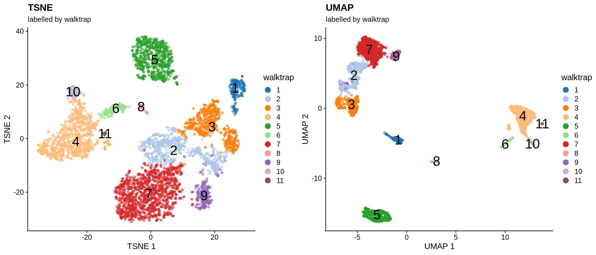
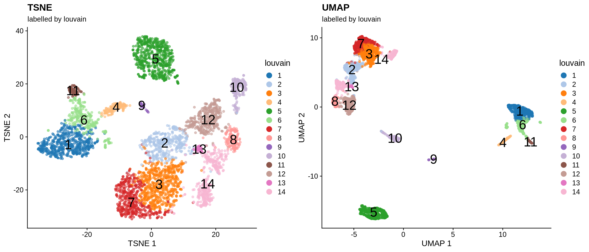
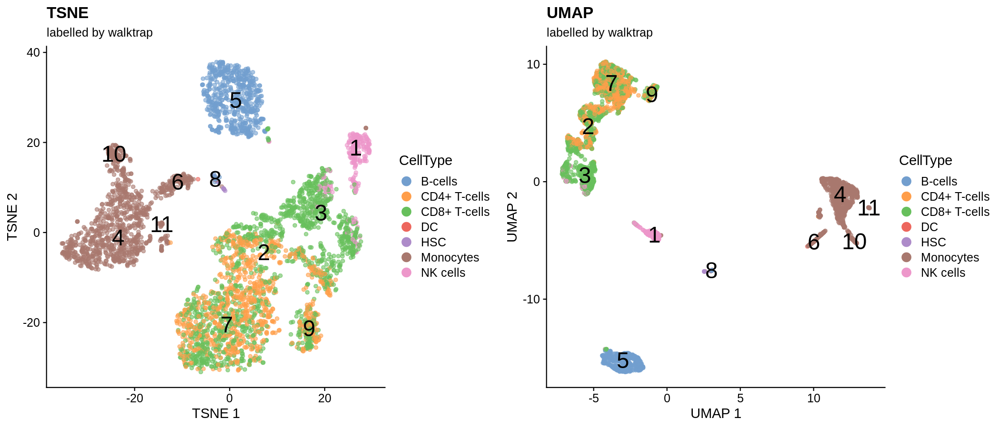
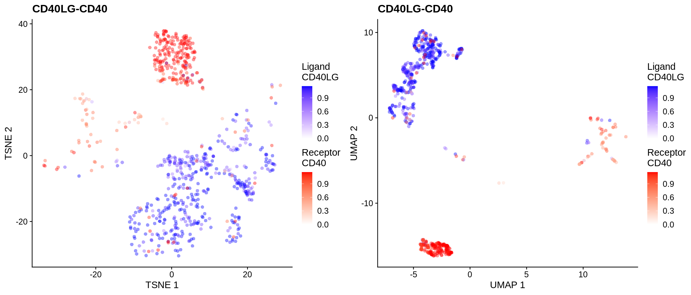
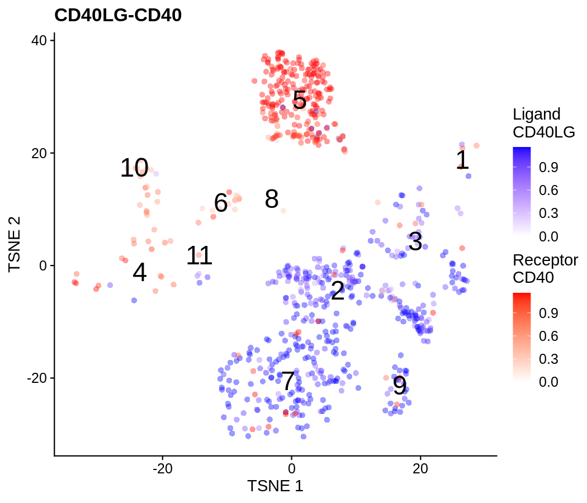
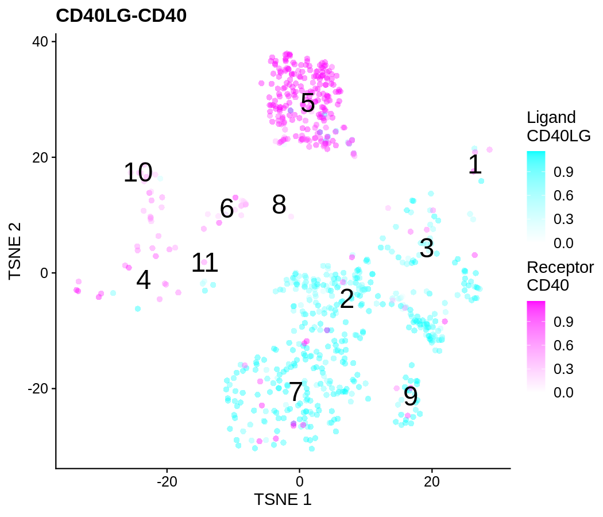
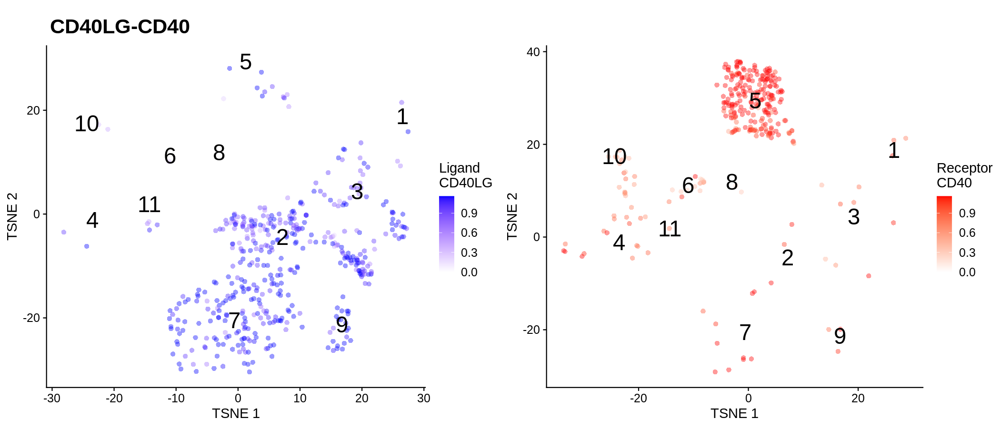
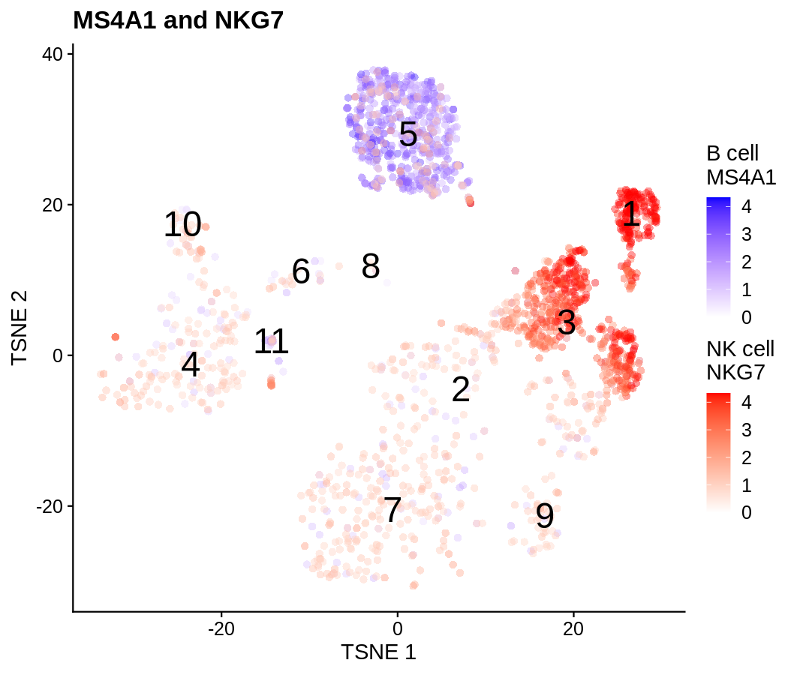

Plot ligand-receptor expression on UMAP and t-SNE projection
============================================================

I-Hsuan Lin

University of Manchester

March 02, 2022

Introduction
------------

This is a reproducible demo that shows readers how to use the function
`plotReducedDimLR` which make use of the
[ggnewscale](https://cran.r-project.org/package=ggnewscale) R package to
ovelay the expressions of ligand and receptor genes on a single plot of
UMAP or t-SNE projection.

### About demo datasets

We use the
[TENxPBMCData](https://bioconductor.org/packages/TENxPBMCData/) R
package to load the `pbmc4k` single-cell RNA-seq dataset on PBMC
generated by 10X Genomics.

Loading required libraries
--------------------------

``` r
library(cowplot)
library(ggrepel)
library(ggnewscale)

# Run PBMC scRNA-seq demo
library(scater)
library(scran)
library(bluster)
library(celldex)
library(SingleR)
library(TENxPBMCData)
```

Load functions from file
------------------------

We use `source` to load the the `plotReducedDimLR` and `add_label`
functions from the file `plotReducedDimLR.R` into the workspace.

Specifically, `plotReducedDimLR` uses the `new_scale_colour` function
from the [ggnewscale](https://cran.r-project.org/package=ggnewscale) R
package to add an additional *layer* where a second geoms will use
another color scale.

``` r
source("plotReducedDimLR.R")
```

**Function 1: `plotReducedDimLR`**

The `plotReducedDimLR` function allows users to create UMAP and t-SNE
plots that show expression of a ligand-receptor pair. The required
arguments to use the function are `object`, `dimred` and `lr_pair`.

-   `object`: a `SingleCellExperiment` object.
-   `dimred`: a string or integer scalar indicating the reduced
    dimension result in `reducedDims(object)` to plot.
-   `lr_pair`: a character vector of length 2 containing the ligand and
    receptor gene symbol.
-   `lr_desc`: a character vector of length 2 containing short
    description to change legend title. Default:
    `c("Ligand","Receptor")`.
-   `lr_color`: a character vector of length 2 containing colour
    aesthetics. Default: `c("blue","red")`.
-   `lr_sep`: a character string to define how the 2 genes terms are
    separated. Default: “-”.
-   `oneplot`: Logical scalar indicating whether to overlay expressions
    in a single plot or generate 2 side-by-side plots. Default: TRUE.
-   `by_exprs_values`: a string or integer scalar specifying which assay
    to obtain expression values from, for use in point aesthetics.
    Default: “logcounts”.
-   `point_size`: a numeric scalar specifying the size of the points.
    Default: 2.
-   `point_alpha`: a numeric scalar (between 0 and 1) specifying the
    transparency. Default: 0.4.
-   `point_shape`: an integer scalar (between 0 and 25) specifying the
    shape aesthetics. Default: 16.
-   `text_by`: a string specifying the column metadata field with which
    to add text labels on the plot.
-   `text_size`: a numeric scalar specifying the size of added text.
    Default: 8.
-   `text_colour`: a string specifying the colour of the added text.
    Default: “black”.
-   `theme_size`: base font size. Default: 14.

**Function 2: `add_label`**

The `add_label` function is a fix of the `plotReducedDim` function from
the `scater` package (wll be fixed in scater v1.23.5). It allows the
added labels to be placed centrally in each cluster. The required
arguments to use the function are `object` and `dimred`.

-   `object`: a `SingleCellExperiment` object.
-   `dimred`: a string or integer scalar indicating the reduced
    dimension result in `reducedDims(object)` to plot.
-   `text_by`: a string specifying the column metadata field with which
    to add text labels on the plot. Default: “label”.
-   `text_size`: a numeric scalar specifying the size of added text.
    Default: 8.
-   `text_colour`: a string specifying the colour of the added text.
    Default: “black”.

Prepare the `pbmc4k` dataset
----------------------------

``` r
#--- data-loading ---#
sce.pbmc <- TENxPBMCData("pbmc4k")
sce.pbmc
```

    ## class: SingleCellExperiment 
    ## dim: 33694 4340 
    ## metadata(0):
    ## assays(1): counts
    ## rownames(33694): ENSG00000243485 ENSG00000237613 ... ENSG00000277475 ENSG00000268674
    ## rowData names(3): ENSEMBL_ID Symbol_TENx Symbol
    ## colnames: NULL
    ## colData names(11): Sample Barcode ... Individual Date_published
    ## reducedDimNames(0):
    ## mainExpName: NULL
    ## altExpNames(0):

``` r
#--- gene-annotation ---#
rownames(sce.pbmc) <- uniquifyFeatureNames(rowData(sce.pbmc)$ENSEMBL_ID, 
                       rowData(sce.pbmc)$Symbol)
is.mito <- grep("^MT-", rowData(sce.pbmc)$Symbol_TENx)

#--- quality-control ---#
stats <- perCellQCMetrics(sce.pbmc, subsets = list(Mito = is.mito))
high.mito <- isOutlier(stats$subsets_Mito_percent, type = "higher")
sce.pbmc <- sce.pbmc[,!high.mito]
```

``` r
#--- normalization ---#
set.seed(10001)
clusters <- quickCluster(sce.pbmc)
sce.pbmc <- computeSumFactors(sce.pbmc, cluster = clusters)
sce.pbmc <- logNormCounts(sce.pbmc)
```

``` r
#--- variance-modelling ---#
set.seed(10001)
dec.pbmc <- modelGeneVarByPoisson(sce.pbmc)
top.pbmc <- getTopHVGs(dec.pbmc, prop = 0.1)
```

``` r
#--- dimensionality-reduction ---#
set.seed(10001)
sce.pbmc <- denoisePCA(sce.pbmc, subset.row = top.pbmc, technical = dec.pbmc)

set.seed(10001)
sce.pbmc <- runTSNE(sce.pbmc, dimred = "PCA")

set.seed(10001)
sce.pbmc <- runUMAP(sce.pbmc, dimred = "PCA")

sce.pbmc
```

    ## class: SingleCellExperiment 
    ## dim: 33694 4175 
    ## metadata(0):
    ## assays(2): counts logcounts
    ## rownames(33694): ENSG00000243485 FAM138A ... ENSG00000277475 FAM231C
    ## rowData names(3): ENSEMBL_ID Symbol_TENx Symbol
    ## colnames: NULL
    ## colData names(12): Sample Barcode ... Date_published sizeFactor
    ## reducedDimNames(3): PCA TSNE UMAP
    ## mainExpName: NULL
    ## altExpNames(0):

``` r
#--- walktrap clustering ---#
clu.walktrap <- clusterCells(sce.pbmc, use.dimred = "PCA", 
                 BLUSPARAM = NNGraphParam(cluster.fun = "walktrap"))
sce.pbmc$walktrap <- clu.walktrap
table(clu.walktrap)
```

    ## clu.walktrap
    ##    1    2    3    4    5    6    7    8    9   10   11 
    ##  187  563  526  811  605  128 1011   46  197   84   17

``` r
#--- louvain clustering ---#
clu.louvain <- clusterCells(sce.pbmc, use.dimred = "PCA", 
                BLUSPARAM = NNGraphParam(cluster.fun = "louvain"))
sce.pbmc$louvain <- clu.louvain
table(clu.louvain)
```

    ## clu.louvain
    ##   1   2   3   4   5   6   7   8   9  10  11  12  13  14 
    ## 536 371 583 127 605 292 429 152  46 188  85 366  37 358

``` r
table(clu.walktrap, clu.louvain)
```

    ##             clu.louvain
    ## clu.walktrap   1   2   3   4   5   6   7   8   9  10  11  12  13  14
    ##           1    0   0   0   0   0   0   0   0   0 187   0   0   0   0
    ##           2    0 361   6   0   0   0   9   3   0   0   0   1  37 146
    ##           3    0  10   0   0   0   0   0 149   0   1   0 365   0   1
    ##           4  535   0   0   0   0 275   0   0   0   0   1   0   0   0
    ##           5    0   0   0   0 605   0   0   0   0   0   0   0   0   0
    ##           6    0   0   0 127   0   1   0   0   0   0   0   0   0   0
    ##           7    0   0 577   0   0   0 420   0   0   0   0   0   0  14
    ##           8    0   0   0   0   0   0   0   0  46   0   0   0   0   0
    ##           9    0   0   0   0   0   0   0   0   0   0   0   0   0 197
    ##           10   0   0   0   0   0   0   0   0   0   0  84   0   0   0
    ##           11   1   0   0   0   0  16   0   0   0   0   0   0   0   0

``` r
#--- cell type annotation ---#
ref <- celldex::BlueprintEncodeData()
pred <- SingleR(test = sce.pbmc, ref = ref, labels = ref$label.main)
table(pred$labels)
```

    ## 
    ##      B-cells CD4+ T-cells CD8+ T-cells           DC          HSC    Monocytes     NK cells 
    ##          609          867         1386            1           12         1060          240

Create plots
------------

### Show cells coloured by cluster assignment

``` r
p1 <- plotReducedDim(sce.pbmc, "TSNE", colour_by = "walktrap", theme_size = 14) +
    guides(color = guide_legend(title = "walktrap", ncol = 1, 
                    override.aes = list(size = 4, alpha = 1))) +
    add_label(sce.pbmc, "TSNE", text_by = "walktrap") + 
    ggtitle("TSNE", subtitle = "labelled by walktrap")

p2 <- plotReducedDim(sce.pbmc, "UMAP", colour_by = "walktrap", theme_size = 14) +
    guides(color = guide_legend(title = "walktrap", ncol = 1, 
                    override.aes = list(size = 4, alpha = 1))) +
    add_label(sce.pbmc, "UMAP", text_by = "walktrap") + 
    ggtitle("UMAP", subtitle = "labelled by walktrap")

p3 <- plotReducedDim(sce.pbmc, "TSNE", colour_by = "louvain", theme_size = 14) +
    guides(color = guide_legend(title = "louvain", ncol = 1, 
                    override.aes = list(size = 4, alpha = 1))) +
    add_label(sce.pbmc, "TSNE", text_by = "louvain") + 
    ggtitle("TSNE", subtitle = "labelled by louvain")

p4 <- plotReducedDim(sce.pbmc, "UMAP", colour_by = "louvain", theme_size = 14) +
    guides(color = guide_legend(title = "louvain", ncol = 1, 
                    override.aes = list(size = 4, alpha = 1))) +
    add_label(sce.pbmc, "UMAP", text_by = "louvain") + 
    ggtitle("UMAP", subtitle = "labelled by louvain")
```

``` r
# Use plot_grid to join plots
plot_grid(p1, p2, nrow = 1)
plot_grid(p3, p4, nrow = 1)
```





### Show cells coloured by cell type assignment

``` r
p1 <- plotReducedDim(sce.pbmc, "TSNE", colour_by = I(pred$labels), theme_size = 14) +
    guides(color = guide_legend(title = "CellType", ncol = 1, 
                    override.aes = list(size = 4, alpha = 1))) +
    add_label(sce.pbmc, "TSNE", text_by = "walktrap") + 
    ggtitle("TSNE", subtitle = "labelled by walktrap")

p2 <- plotReducedDim(sce.pbmc, "UMAP", colour_by = I(pred$labels), theme_size = 14) +
    guides(color = guide_legend(title = "CellType", ncol = 1, 
                    override.aes = list(size = 4, alpha = 1))) +
    add_label(sce.pbmc, "UMAP", text_by = "walktrap") + 
    ggtitle("UMAP", subtitle = "labelled by walktrap")
```

``` r
# Use plot_grid to join plots
plot_grid(p1, p2, nrow = 1)
```



### Show cells coloured by CD40LG and CD40 expression

The **CD40LG-CD40** is one of the well-characterised ligand-receptor
pairs between T cells and B cells.
[ref](https://pubmed.ncbi.nlm.nih.gov/19426221/)

-   The CD40LG (also known as CD154 or CD40L) encodes the CD40 ligand
    that is predominantly expressed in activated T cells. \[**walktrap
    clusters 2, 3, 7 and 9**\]
-   The CD40 molecule is a costimulatory receptor expressed by B cells
    and antigen-presenting cells (APCs). \[**walktrap cluster 5**\]

#### Minimal arguments

-   A `SingleCellExperiment` object.
-   A string or integer scalar indicating the reduced dimension result
    in `reducedDims(object)` to plot.
-   A character vector of length 2 containing the ligand and receptor
    gene symbol.

``` r
p1 <- plotReducedDimLR(sce.pbmc, "TSNE", c("CD40LG","CD40"))
p2 <- plotReducedDimLR(sce.pbmc, "UMAP", c("CD40LG","CD40"))
```

``` r
# Use plot_grid to join plots
plot_grid(p1, p2, nrow = 1)
```



#### Labelled by cluster assignment

-   Use `text_by` to add labels.

``` r
plotReducedDimLR(sce.pbmc, "TSNE", c("CD40LG","CD40"), text_by = "walktrap")
```



#### Change expression colours

-   Use `lr_color` to change colours.

``` r
plotReducedDimLR(sce.pbmc, "TSNE", c("CD40LG","CD40"), text_by = "walktrap", 
         lr_color = c("cyan","magenta"))
```



#### Show expression of ligand-receptor pairs separately

-   Set `oneplot = FALSE` to show 2 separate plots.

``` r
plotReducedDimLR(sce.pbmc, "TSNE", c("CD40LG","CD40"), text_by = "walktrap", 
         oneplot = FALSE)
```



#### Show expression of 2 genes (not necessary a LR pair)

-   Use `lr_desc` to change legend title.
-   Use `lr_sep` to change how the genes are separated in title.

``` r
plotReducedDimLR(sce.pbmc, "TSNE", c("MS4A1","NKG7"), lr_desc = c("B cell","NK cell"), 
         lr_sep = " and ", text_by = "walktrap")
```



Session Info
------------

``` r
sessionInfo()
```

<details>
<summary>
Click to expand
</summary>

    ## R version 4.1.2 (2021-11-01)
    ## Platform: x86_64-conda-linux-gnu (64-bit)
    ## Running under: Ubuntu 20.04.4 LTS
    ## 
    ## Matrix products: default
    ## BLAS/LAPACK: /home/ihsuan/miniconda3/envs/jupyterlab/lib/libopenblasp-r0.3.18.so
    ## 
    ## locale:
    ##  [1] LC_CTYPE=en_GB.UTF-8       LC_NUMERIC=C               LC_TIME=en_GB.UTF-8       
    ##  [4] LC_COLLATE=en_GB.UTF-8     LC_MONETARY=en_GB.UTF-8    LC_MESSAGES=en_GB.UTF-8   
    ##  [7] LC_PAPER=en_GB.UTF-8       LC_NAME=C                  LC_ADDRESS=C              
    ## [10] LC_TELEPHONE=C             LC_MEASUREMENT=en_GB.UTF-8 LC_IDENTIFICATION=C       
    ## 
    ## attached base packages:
    ## [1] stats4    stats     graphics  grDevices utils     datasets  methods   base     
    ## 
    ## other attached packages:
    ##  [1] TENxPBMCData_1.12.0         HDF5Array_1.22.1            rhdf5_2.38.0               
    ##  [4] DelayedArray_0.20.0         Matrix_1.4-0                SingleR_1.8.1              
    ##  [7] celldex_1.4.0               bluster_1.4.0               scran_1.22.1               
    ## [10] scater_1.22.0               scuttle_1.4.0               SingleCellExperiment_1.16.0
    ## [13] SummarizedExperiment_1.24.0 Biobase_2.54.0              GenomicRanges_1.46.1       
    ## [16] GenomeInfoDb_1.30.1         IRanges_2.28.0              S4Vectors_0.32.3           
    ## [19] BiocGenerics_0.40.0         MatrixGenerics_1.6.0        matrixStats_0.61.0         
    ## [22] ggnewscale_0.4.6            ggrepel_0.9.1               ggplot2_3.3.5              
    ## [25] cowplot_1.1.1               knitr_1.37                 
    ## 
    ## loaded via a namespace (and not attached):
    ##   [1] Rtsne_0.15                    ggbeeswarm_0.6.0              colorspace_2.0-3             
    ##   [4] ellipsis_0.3.2                XVector_0.34.0                BiocNeighbors_1.12.0         
    ##   [7] farver_2.1.0                  bit64_4.0.5                   RSpectra_0.16-0              
    ##  [10] interactiveDisplayBase_1.32.0 AnnotationDbi_1.56.2          fansi_1.0.2                  
    ##  [13] codetools_0.2-18              sparseMatrixStats_1.6.0       cachem_1.0.6                 
    ##  [16] cluster_2.1.2                 dbplyr_2.1.1                  png_0.1-7                    
    ##  [19] uwot_0.1.11                   shiny_1.7.1                   BiocManager_1.30.16          
    ##  [22] compiler_4.1.2                httr_1.4.2                    dqrng_0.3.0                  
    ##  [25] assertthat_0.2.1              fastmap_1.1.0                 limma_3.50.1                 
    ##  [28] cli_3.2.0                     later_1.3.0                   BiocSingular_1.10.0          
    ##  [31] htmltools_0.5.2               tools_4.1.2                   rsvd_1.0.5                   
    ##  [34] igraph_1.2.11                 gtable_0.3.0                  glue_1.6.2                   
    ##  [37] GenomeInfoDbData_1.2.7        dplyr_1.0.8                   rappdirs_0.3.3               
    ##  [40] Rcpp_1.0.8                    rhdf5filters_1.6.0            vctrs_0.3.8                  
    ##  [43] Biostrings_2.62.0             ExperimentHub_2.2.1           DelayedMatrixStats_1.16.0    
    ##  [46] xfun_0.29                     stringr_1.4.0                 beachmat_2.10.0              
    ##  [49] mime_0.12                     lifecycle_1.0.1               irlba_2.3.5                  
    ##  [52] statmod_1.4.36                AnnotationHub_3.2.1           edgeR_3.36.0                 
    ##  [55] zlibbioc_1.40.0               scales_1.1.1                  promises_1.2.0.1             
    ##  [58] parallel_4.1.2                yaml_2.3.5                    curl_4.3.2                   
    ##  [61] memoise_2.0.1                 gridExtra_2.3                 stringi_1.7.6                
    ##  [64] RSQLite_2.2.10                highr_0.9                     BiocVersion_3.14.0           
    ##  [67] ScaledMatrix_1.2.0            filelock_1.0.2                BiocParallel_1.28.3          
    ##  [70] rlang_1.0.1                   pkgconfig_2.0.3               bitops_1.0-7                 
    ##  [73] evaluate_0.15                 lattice_0.20-45               Rhdf5lib_1.16.0              
    ##  [76] purrr_0.3.4                   labeling_0.4.2                bit_4.0.4                    
    ##  [79] tidyselect_1.1.2              RcppAnnoy_0.0.19              magrittr_2.0.2               
    ##  [82] R6_2.5.1                      generics_0.1.2                metapod_1.2.0                
    ##  [85] DBI_1.1.2                     pillar_1.7.0                  withr_2.4.3                  
    ##  [88] KEGGREST_1.34.0               RCurl_1.98-1.6                tibble_3.1.6                 
    ##  [91] crayon_1.5.0                  utf8_1.2.2                    BiocFileCache_2.2.1          
    ##  [94] rmarkdown_2.11                viridis_0.6.2                 locfit_1.5-9.4               
    ##  [97] grid_4.1.2                    blob_1.2.2                    digest_0.6.29                
    ## [100] xtable_1.8-4                  httpuv_1.6.5                  munsell_0.5.0                
    ## [103] beeswarm_0.4.0                viridisLite_0.4.0             vipor_0.4.5

</details>
